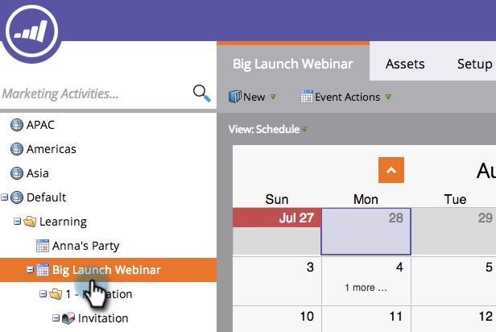
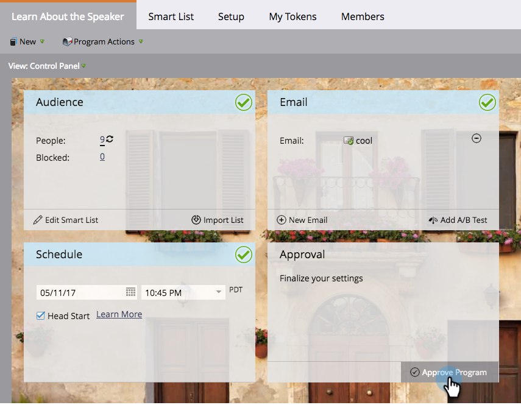

# Creating a New Email Program in the Schedule View {#creating-a-new-email-program-in-the-schedule-view}

You can build an email program from within the program schedule view. Here's how.

1. Go to **[!UICONTROL Marketing Activities]**.

   

1. Select your program.

   

1. Select the date you'd like your email program to run on.

   

1. Enter a name. Select **[!UICONTROL Email Program]**.

   

1. In the entry details, click the link to your new email program.

   

1. [Set up your email program](/help/marketo/product-docs/email-marketing/email-programs/creating-an-email-program/create-an-email-program.md){target="_blank"} and click **[!UICONTROL Approve Program]**.

   

   Besides the detailed dashboard, an advantage to using an [email program](/help/marketo/product-docs/email-marketing/email-programs/creating-an-email-program/understanding-email-programs.md){target="_blank"} instead of a smart campaign is the ability to easily implement an [A/B test](/help/marketo/product-docs/email-marketing/email-programs/email-program-actions/email-test-a-b-test/add-an-a-b-test.md){target="_blank"}. Enjoy!
