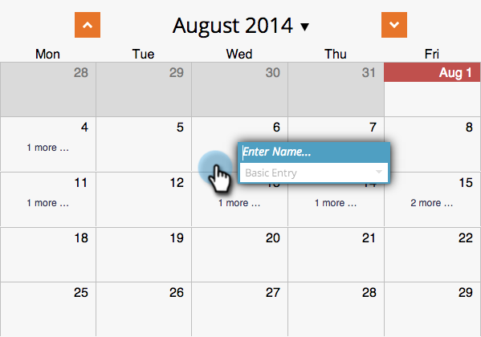
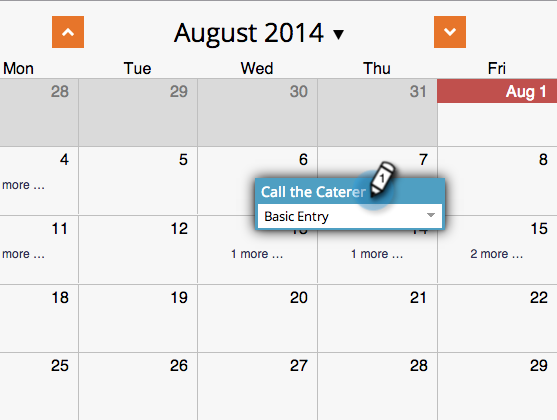
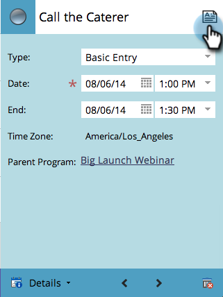
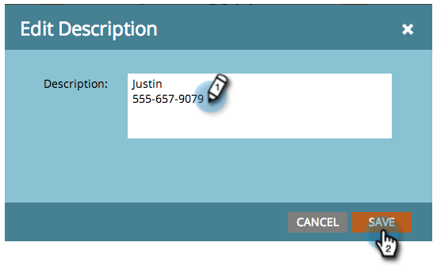
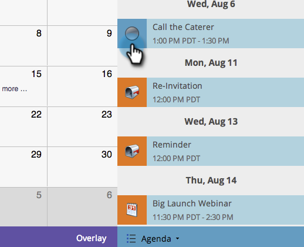

# Creating an Entry in the Program Schedule View {#creating-an-entry-in-the-program-schedule-view}

You can create entries from within the program schedule view to supplement an existing program.

## Create a Basic Entry {#create-a-basic-entry}

1. Go to **Marketing Activities**.

   

1. Select your program. Click the **View** drop-down. Select **Schedule**.

   

1. Click a day to add the entry to.

   

1. Name the entry. Press **Enter** to confirm the name.

   

1. Select the start and end date/time of your new entry.

   

1. Click the description icon to add additional information.

   

1. Enter your description and click **Save**.

   

1. Hover over the description icon to view the entry description.

   

## Change Entry Type {#change-entry-type}

1. Select a basic entry from the **Agenda** view.

   

1. Select the **Type** drop-down. Choose a new entry type.

   >[!NOTE]
   >
   >To-do is a [custom entry](/help/marketo/product-docs/core-marketo-concepts/programs/program-schedule-view/create-custom-entry-types.md). You can make a to-do and other custom entries to help keep track of non-Marketo agenda items.

   

   Cool! You should see the changes immediately.

   

>[!NOTE]
>
> You can also create a [smart campaign](/help/marketo/product-docs/core-marketo-concepts/programs/program-schedule-view/creating-a-batch-smart-campaign-in-the-program-schedule-view.md) or [email program](/help/marketo/product-docs/core-marketo-concepts/programs/program-schedule-view/creating-a-new-email-program-in-the-schedule-view.md) from the schedule view.
