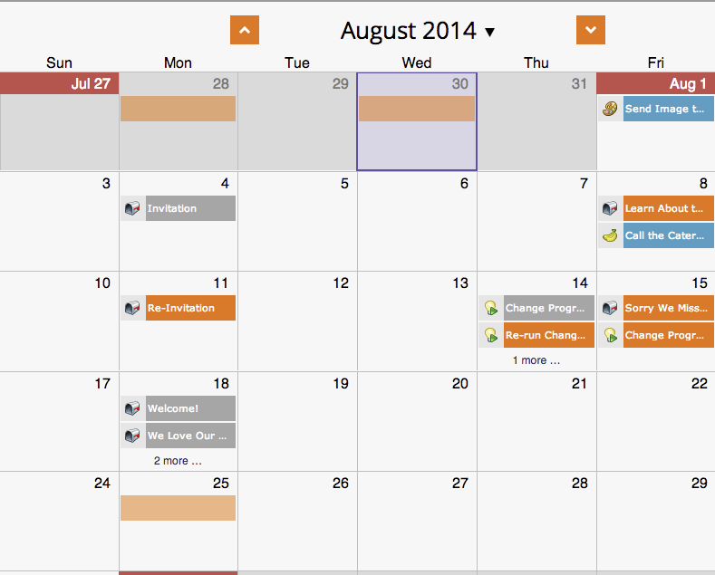

# Creating Custom Overlays in Program Schedule View {#creating-custom-overlays-in-program-schedule-view}

Creating Custom Overlays in Program Schedule View - Marketo Docs - Product Documentation

You can create custom overlays to view entries relevant to your needs.

1. Click the **Agenda** drop-down. 

   

1. Select **Overlays**. 

   

1. Select the entry types you'd like to be visible in your overlay. 

   

1. You can also filter by [program tags](../../../../product-docs/core-marketo-concepts/programs/working-with-programs/understanding-tags/use-tags-in-a-program.md). 

   

   Awesome. Now your overlay will only display the entries you've defined.

   

