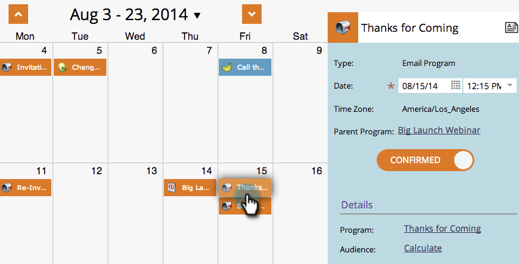
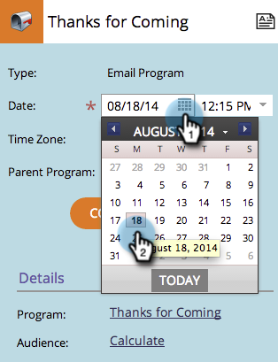

# Editing Entries in the Program Schedule View {#editing-entries-in-the-program-schedule-view}

You can make edits to the different elements of your program in the schedule view.

## Edit an Entry's Name {#edit-an-entrys-name}

1. Select the entry you'd like to edit.

   

1. Type in a new name and press **Enter/Return** on your keyboard to confirm the change.

   

>[!CAUTION]
>
>This only changes the display name in the schedule view. The name of the asset in your program will remain the same.

## Edit an Entry's Description {#edit-an-entrys-description}

1. Click the description icon.

   

1. Edit your description. Click **Save**.

   

1. Great! Your description is now changed.

   

## Edit an Entry's Date {#edit-an-entrys-date}

1. Select the new date.

   

You rock! Now the date of your entry has been moved to a new date.

>[!NOTE]
>
> Smart campaign and email program entries that have already run cannot be moved to the past.
