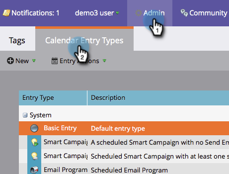
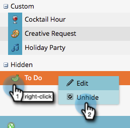

# Hiding and Unhiding Custom Entry Types {#hiding-and-unhiding-custom-entry-types}

Custom entry types can be hidden in the Admin section. Once hidden, the entry type will no longer be displayed as an option.

## Hide a Custom Entry Type {#hide-a-custom-entry-type}

1. Go to the **Admin** section and click **Calendar Entry** **Types**.

   

1. Right-click your custom entry and click **Hide**.

   

   Awesome. This entry type will no longer be available for use.

## Unhide a Custom Entry Type {#unhide-a-custom-entry-type}

   If you want to unhide a custom entry type, that's easy, too.

1. Right-click your entry and select **Unhide**.

   

   Ta-da! Your custom entry type is now unhidden.

   
