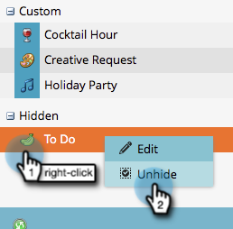

# Hiding and Unhiding Custom Entry Types {#hiding-and-unhiding-custom-entry-types}

Custom entry types can be hidden in the Admin section. Once hidden, the entry type will no longer be displayed as an option.

## Hide a Custom Entry Type {#hide-a-custom-entry-type}

1. Go to the **[!UICONTROL Admin]** section and click **[!UICONTROL Calendar Entry Types]**.

   

1. Right-click your custom entry and click **[!UICONTROL Hide]**.

   

   This entry type will no longer be available for use.

## Unhide a Custom Entry Type {#unhide-a-custom-entry-type}

   To unhide a custom entry type:

1. Right-click your entry and select **[!UICONTROL Unhide]**.

   

   The custom entry type is now visible.

   
