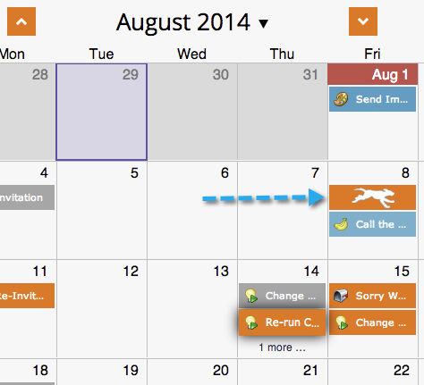
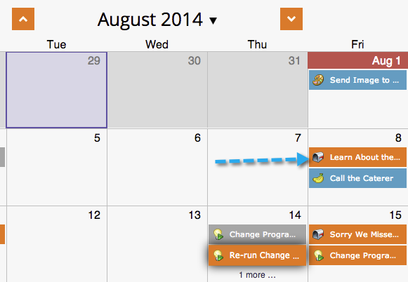

# Moving Entries in the Program Schedule View {#moving-entries-in-the-program-schedule-view}

Moving entries in the schedule view will automatically reschedule them.

>[!NOTE]
>
>An already-run smart campaign, engagement program, or mail blast can't be moved.

1. Select your entry. Drag and drop it to a different date.

   

1. Our data retriever then unapproves, changes the date, and reapproves the asset. He's cool like that.

   

   Your entry will now be rescheduled.

   
