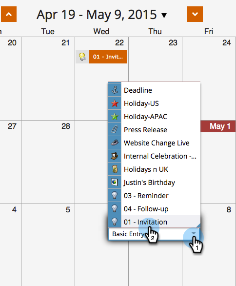

# Rerun a Smart Campaign in the Program Schedule View {#rerun-a-smart-campaign-in-the-program-schedule-view}

You can easily create new runs of an existing smart campaign directly from the program schedule view.

1. Go to **Marketing Activities**.

   

1. Select a program that contains your smart campaign.

   

1. In the schedule view, click the day you want to set your new run for, and give your entry a name that's easily understood (e.g., "Second Invite").

   

1. Select the entry type menu drop-down, and pick the smart campaign you'd like to rerun.

   

   >[!TIP]
   >
   >You can also do this from the [program focus](/help/marketo/product-docs/core-marketo-concepts/marketing-calendar/understanding-the-calendar/understand-enable-program-focus.md).

Boom! Just like that, you've scheduled another run for that smart campaign. If that smart campaign contained send email steps, you'll see those too!
