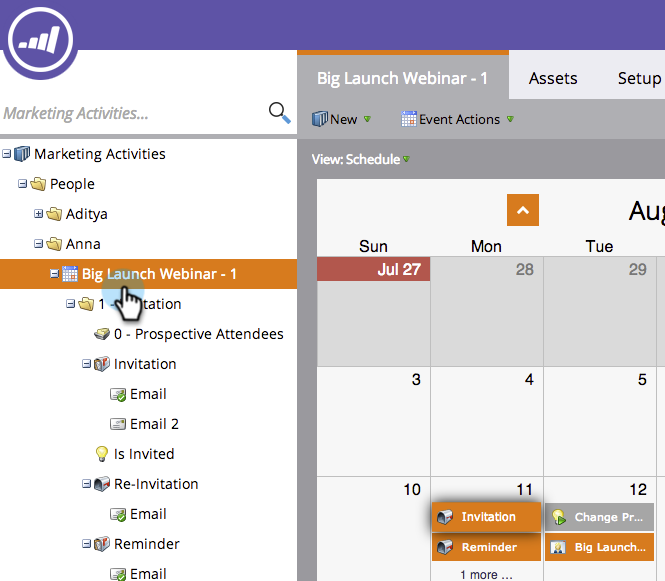
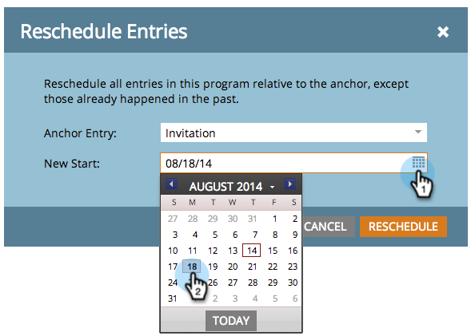
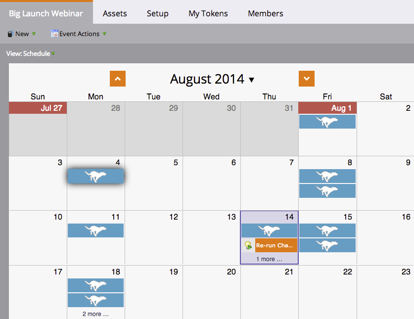

# Rescheduling an Entire Program from the Schedule View {#rescheduling-an-entire-program-from-the-schedule-view}

When you clone a program or event with dates, you will likely want to reschedule all of the dates at once. Here's how.

1. Select the program you want to reschedule.

   

1. Select the Event Action drop-down. Choose **[!UICONTROL Reschedule Entries]**.

   

1. Select an anchor entry. Based on this move, all of the other entries will move along with it.

   

1. Choose the new start date.

   

1. Click **[!UICONTROL Reschedule]**.

   

1. Our data retrievers will then unapprove, reschedule, and reapprove all your assets with the correct dates!

   

>[!NOTE]
>
>Assets that have already run will not move.

Everything is now rescheduled. Adjust any specific dates as needed.

