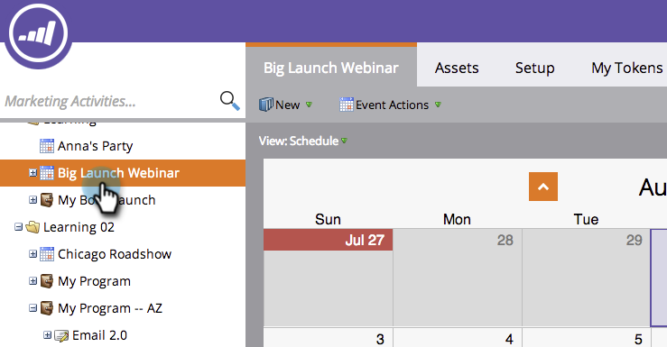
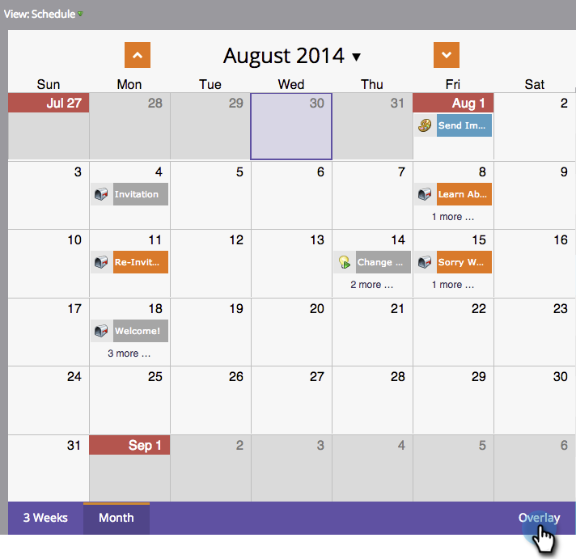
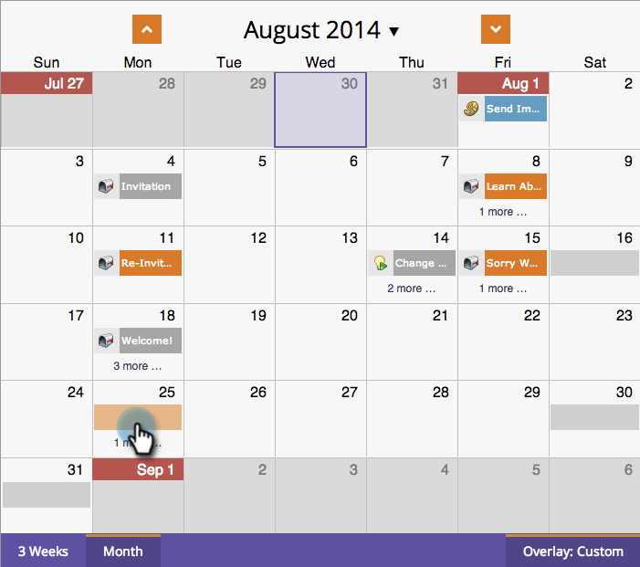
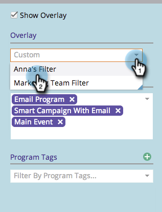
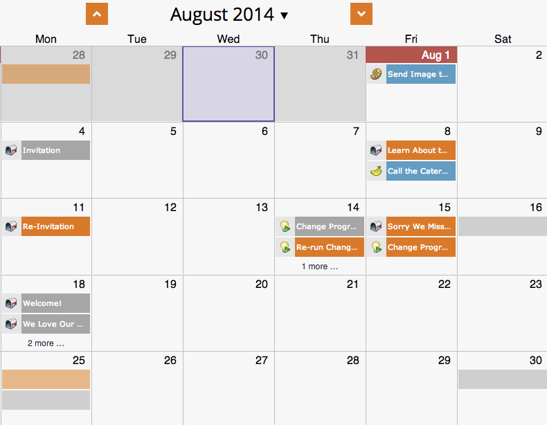

# Using a Global Overlay {#using-a-global-overlay}

The global overlay in the program schedule view lets you see your program in relation to other scheduled assets.

>[!PREREQUISITES]
>
>You must have a [Marketing Calendar license](/help/marketo/product-docs/core-marketo-concepts/marketing-calendar/understanding-the-calendar/issue-revoke-a-marketing-calendar-license.md){target="_blank"} to utilize this feature.

## Use the Global Overlay {#use-the-global-overlay}

1. Select your program.

   

1. Select **[!UICONTROL Overlay]** in the bottom right corner.

   

1. The solid blocks represent entries on that date. Click to see details.

   

   The entry details for overlay items will be read-only. Click on the parent program to make changes.

   

## Use a Saved Filter as an Overlay {#use-a-saved-filter-as-an-overlay}

   If you've [saved a filter in the Marketing Calendar](/help/marketo/product-docs/core-marketo-concepts/marketing-calendar/working-with-the-calendar/saving-a-filter-definition-in-the-marketing-calendar.md){target="_blank"}, you can use it as an overlay in the program schedule view.

1. Click the **[!UICONTROL Overlay]** drop-down and select your filter definition.

   

   Now you'll see an overlay defined by the filter you've saved and selected.

   

   >[!MORELIKETHIS]
   >
   >[Creating Custom Overlays in the Program Schedule View](/help/marketo/product-docs/core-marketo-concepts/programs/program-schedule-view/creating-custom-overlays-in-program-schedule-view.md){target="_blank"}
