# Managing My Tokens {#managing-my-tokens}

Using tokens can simplify your efforts in Marketo Engage. You can use [My Tokens](/help/marketo/product-docs/core-marketo-concepts/programs/tokens/understanding-my-tokens-in-a-program.md){target="_blank"} (custom tokens) in flow steps, webhooks, emails, and Landing Pages. Here's how to make them.

>[!TIP]
>
>Learn more about what tokens are already available in [Tokens Overview](/help/marketo/product-docs/demand-generation/landing-pages/personalizing-landing-pages/tokens-overview.md){target="_blank"}.

## Create a local or global My Token {#create-a-my-token}

>[!BEGINTABS]

>[!TAB Local My Tokens]

1. In **[!UICONTROL Marketing Activities]**, select the desired program or campaign folder and click its **[!UICONTROL My Tokens]** tab.

   

1. Drag the desired My Token onto the canvas.

   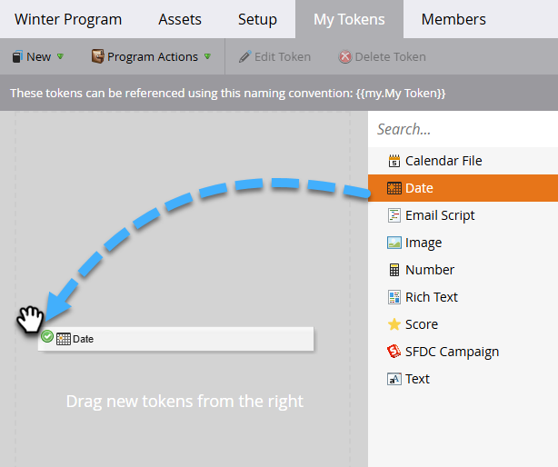

1. Type a unique name and enter a relevant value.

   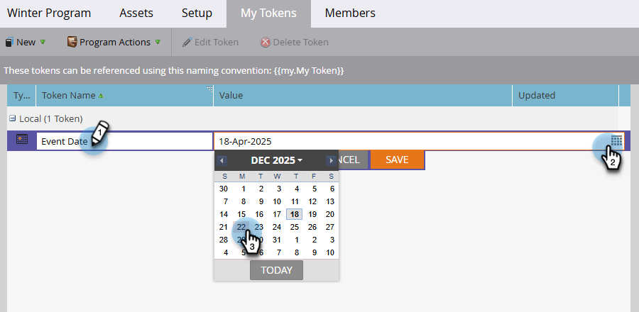

1. Click **[!UICONTROL Save]**.

   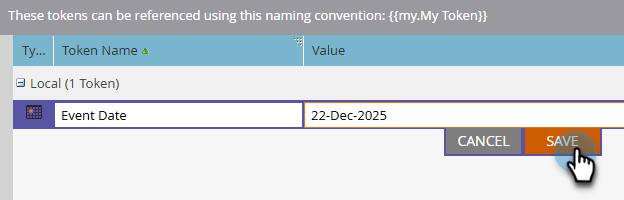

>[!TAB Global My Tokens]

>[!NOTE]
>
>Admin permissions required.

1. Go to the **[!UICONTROL Admin]** area and select **[!UICONTROL My Tokens]**.

   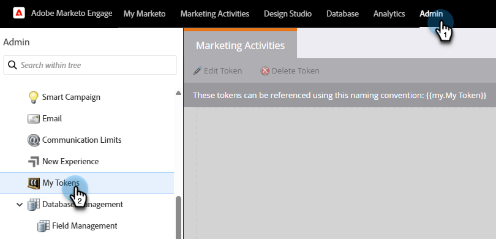

1. Drag the desired My Token onto the canvas.

   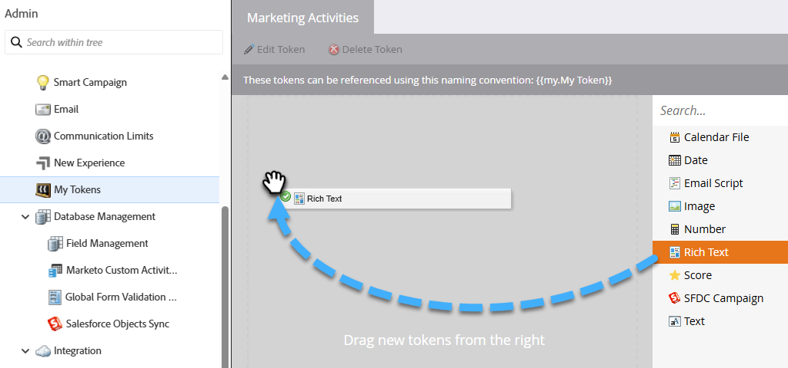

1. Type a unique name and enter a relevant value.

   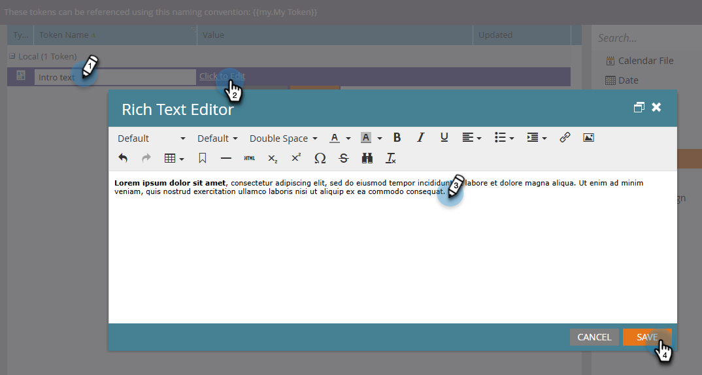

1. Click **[!UICONTROL Save]**.

   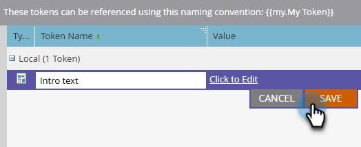

>[!ENDTABS]

## Edit a My Token {#edit-a-my-token}

1. Select the token you wish to edit and click **[!UICONTROL Edit Token]**.

   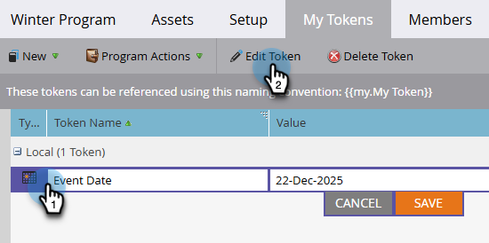

1. Make your desired edits. Click **[!UICONTROL Save]** when done.

   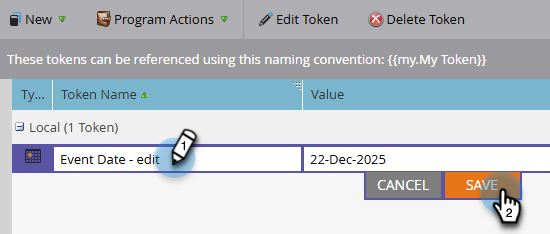

## Delete a My Token {#delete-a-my-token}

>[!CAUTION]
>
>When you delete a My Token, make sure it isn't currently referenced in any asset. A blank space will display in any place it's referenced if deleted.

1. Select the token you wish to delete and click **[!UICONTROL Delete Token]**.

   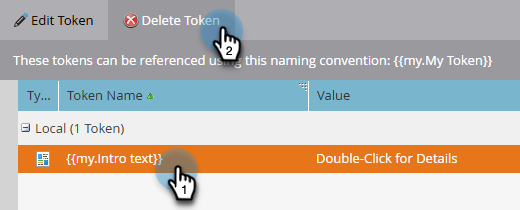

1. Click **[!UICONTROL Delete]**.

   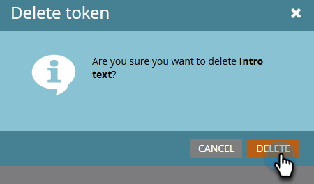

   >[!MORELIKETHIS]
   >
   >* [Tokens Overview](/help/marketo/product-docs/demand-generation/landing-pages/personalizing-landing-pages/tokens-overview.md){target="_blank"}
   >* [Understanding My Tokens in a Program](/help/marketo/product-docs/core-marketo-concepts/programs/tokens/understanding-my-tokens-in-a-program.md){target="_blank"}
   >* [Using URLs in My Tokens](/help/marketo/product-docs/email-marketing/general/using-tokens/using-urls-in-my-tokens.md){target="_blank"}
