# Program Member Custom Field Tokens {#program-member-custom-field-tokens}

## Token Support for Program Member Custom Fields {#token-support-for-program-member-custom-fields}

On the back of Program Member Custom Fields features, support is being extended for Program Member Custom Fields in token frameworks.

The PMCF tokens will be supported under the member domain of the tokens family.

Member Tokens are used for fields under the scope of Program Member. As of current state, Member Tokens are also used to insert unique values from integrated services partners. `{{member.webinar url}}` token automatically resolves the person's unique confirmation URL generated by the service provider. {{member.registration code}} resolves to the registration code provided by the service provider.

>[!NOTE]
>
>* Program Member Custom Fields can be used only in the context of a program.
>* Program Member Custom Fields Tokens cannot be used in: email preheader, Date Tokens in Wait Steps, or Snippets.
>* Program Member Status is not supported in Member Tokens.

## Using Program Member Custom Field Tokens in Assets {#using-program-member-custom-field-tokens-in-assets}

You can insert Program Member Custom Fields Tokens into emails, Landing Pages, SMS, push notifications and Webhooks.

**Emails**

1. Select the desired email and click **[!UICONTROL Edit Draft]**.

   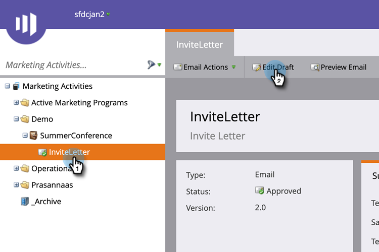

1. Click the Insert Token icon.

   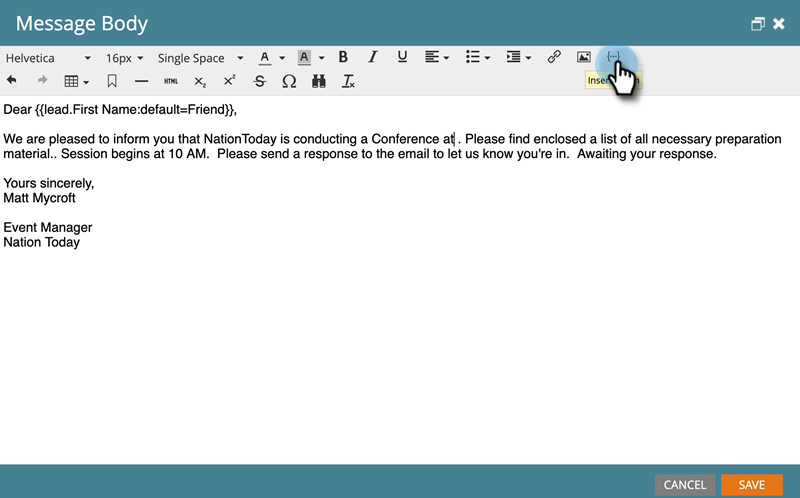

1. Find and select the desired Program Member Custom Field Token, enter a default value, and click **[!UICONTROL Insert]**.

   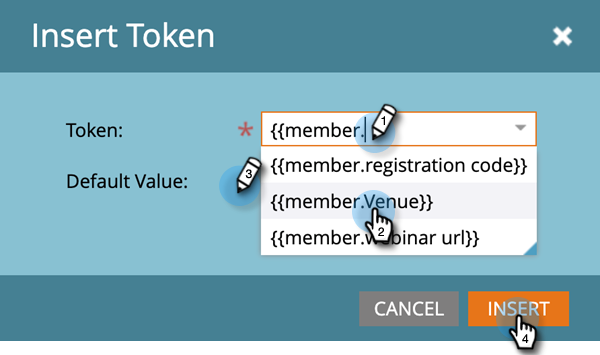

1. Click **[!UICONTROL Save]**.

   

>[!NOTE]
>
>Don't forget to approve your email.

**Landing Pages**

1. Select your Landing Page and click **[!UICONTROL Edit Draft]**.

   

   >[!NOTE]
   >
   >The landing page designer opens in a new window.

1. Double-click the rich text box you want to add the token to.

   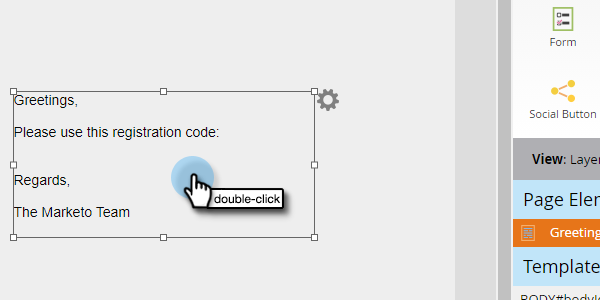

1. Click where you want the token to be, then click the Insert Token icon.

   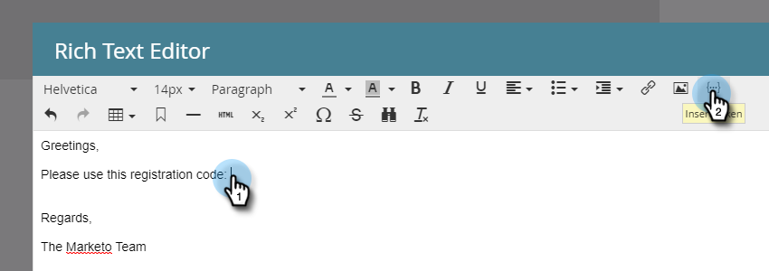

1. Find and select the desired token.

   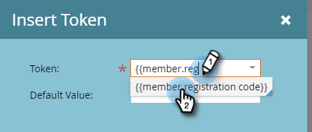

1. Enter a Default Value and click **[!UICONTROL Insert]**.

   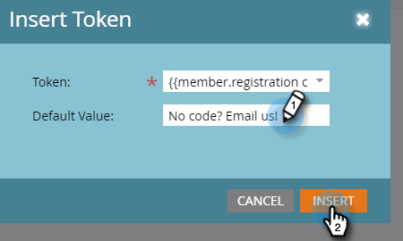

1. Click **[!UICONTROL Save]**.

   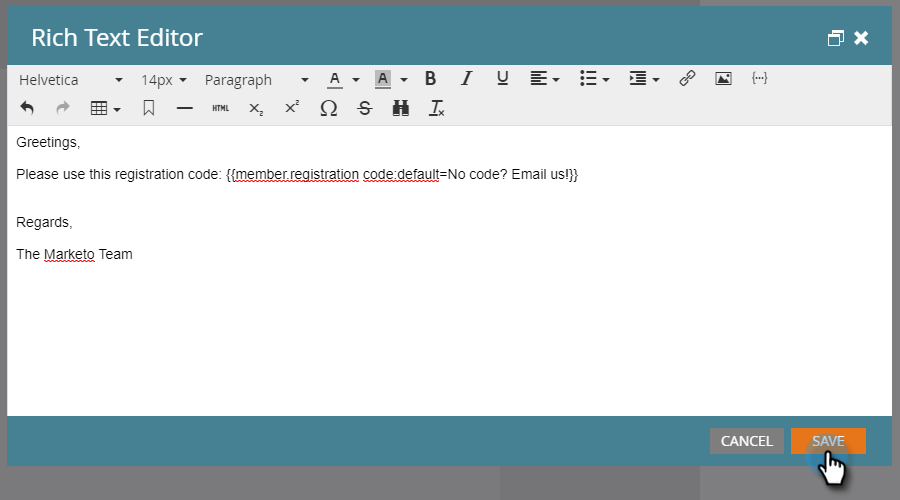

**SMS**

1. Select the desired SMS and click **[!UICONTROL Edit Draft]**.

   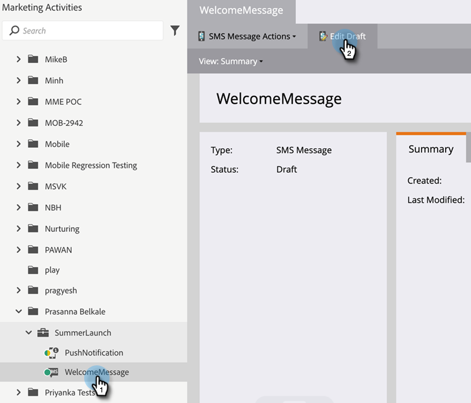

1. Click the **`{{ Token`** button.

   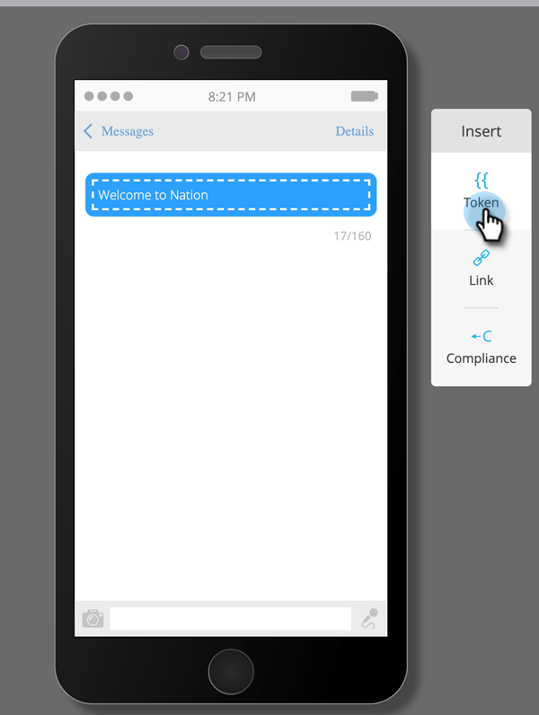

1. Find and select the desired Program Member Custom Field Token. Enter a default value and click Insert.

   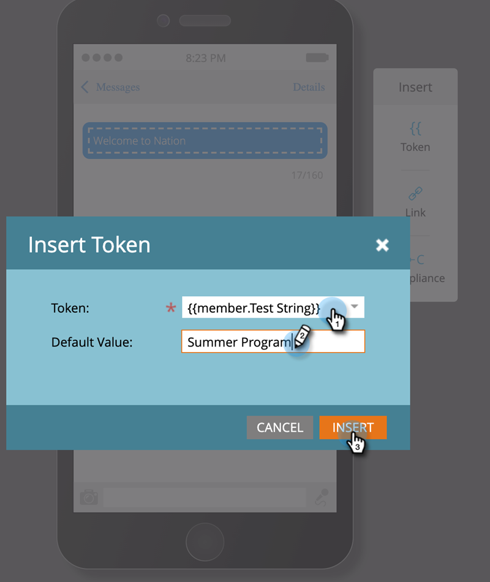

1. Click the SMS Actions drop-down and select **[!UICONTROL Approve & Close]**.

   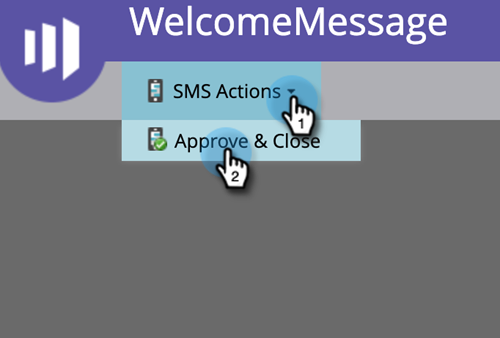

**Push Notifications**

1. Select the desired push notification and click **[!UICONTROL Edit Draft]**.

   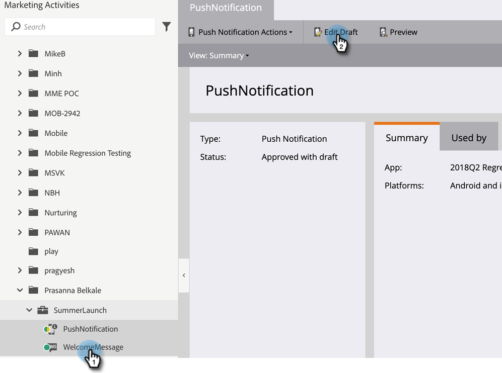

1. Click **[!UICONTROL Push Notification]**.

   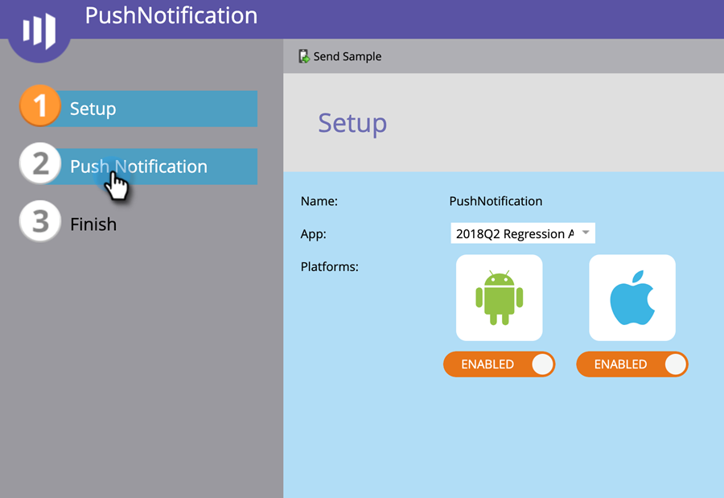

1. Click on the message in the editor and click the `{{` button to get the token selector.

   

1. Find and select the desired Program Member Custom Field Token. Enter a default value and click **[!UICONTROL Insert]**.

   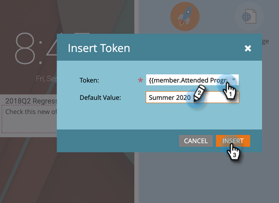

1. Click **[!UICONTROL Finish]** to save and quit (or **[!UICONTROL Next]** to review first).

   

>[!NOTE]
>
>If the Program Member Custom Field for a Member of the program does not have value, the token will be substituted with the default value if it has been provided.

## Using Program Member Custom Field Tokens in Campaigns {#using-program-member-custom-field-tokens-in-campaigns}

Program Member Custom Field Tokens can be used in:

* Create Task
* Create Task in Microsoft
* Interesting Moments
* Change Data Value Flow Actions
* Webhooks
