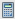
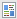

# Understanding My Tokens in a Program {#understanding-my-tokens-in-a-program}

A token is a variable that you can use in emails, landing pages, and smart campaigns to make your life easier.

In addition to My Tokens, you can also use any of the built-in tokens in your programs. Check out the [Tokens Overview](/help/marketo/product-docs/demand-generation/landing-pages/personalizing-landing-pages/tokens-overview.md).

## My Tokens  {#my-tokens}

My Tokens are custom variables that anyone can create. They are [created](/help/marketo/product-docs/core-marketo-concepts/programs/tokens/managing-my-tokens.md) in either campaign folders or programs.

My Tokens are displayed like this: `{{my.Name Of Token}}`

Examples:

* `{{my.Event Date}}`
* `{{my.Webinar Speaker}}`

<table> 
 <thead> 
  <tr> 
   <th>Token Type</th> 
   <th>Description</th> 
  </tr> 
 </thead> 
 <tbody> 
  <tr> 
   <td>Calendar File </td> 
   <td>Use this token to <a href="../../../../product-docs/email-marketing/general/functions-in-the-editor/create-a-calendar-event-ics-file.md">add a calendar event file (.i</a><a href="../../../../product-docs/email-marketing/general/functions-in-the-editor/create-a-calendar-event-ics-file.md">cs)</a> to your emails and landing pages.</td> 
  </tr> 
  <tr> 
   <td>
Date 
</td> 
   <td>This token holds a date value. The date displays as year-month-day (e.g., 2016-05-23).</td> 
  </tr> 
  <tr> 
   <td>Email Script </td> 
   <td>Use this token to execute a Velocity script in your emails. Learn more <a href="http://developers.marketo.com/documentation/email-scripting/" title="Follow link" rel="nofollow">here</a>. </td> 
  </tr> 
  <tr> 
   <td>Number </td> 
   <td>Any integer. It can even be negative.</td> 
  </tr> 
  <tr> 
   <td>Rich Text </td> 
   <td>This is HTML. Use it in emails and landing pages.</td> 
  </tr> 
  <tr> 
   <td>Score </td> 
   <td>Use this token in the <a href="../../../../product-docs/core-marketo-concepts/smart-campaigns/flow-actions/use-tokens-in-flow-steps.md">change score flow step</a>. </td> 
  </tr> 
  <tr> 
   <td colspan="1">SFDC Campaign </td> 
   <td colspan="1">Use this token to allow leads that become part of a Marketo Program to also be added to whatever SFDC Campaign is added.</td> 
  </tr> 
  <tr> 
   <td>Text </td> 
   <td>Just some text. Use it when HTML is overkill. The size limit for Text tokens is 524,288 characters (UTF-8), or 2 MB.</td> 
  </tr> 
 </tbody> 
</table>

>[!CAUTION]
>
>My Tokens will not resolve when sending an email from Sales Insight on either Microsoft Dynamics or Salesforce; only standard tokens will populate (Lead, Company, etc.). Default values for tokens *will* work, however.

## Nesting Tokens {#nesting-tokens}

When you make a new token, it can be referenced by other objects in the tree. There's a naming structure for where the token was created for easy management.

* **Local Token:** The token was created right in that program or folder.
* **Inherited Token:** The token was created up the tree somewhere in a higher level program or folder.
* **Overridden Token:** The token was inherited and then someone made an exception in this program or folder.

You can make global variables and then override them at lower levels in the tree.

Moving programs and folders affects tokens too. Always check to make sure that references aren't broken during the move.

>[!NOTE]
>
>If the email you send from an engagement program is a child email of a default program (not local to your engagement program), any My Tokens used in the email are resolved from the default program in which the child email resides.

>[!MORELIKETHIS]
>
>* [Tokens Overview](/help/marketo/product-docs/demand-generation/landing-pages/personalizing-landing-pages/tokens-overview.md)
>* [Managing My Tokens](/help/marketo/product-docs/core-marketo-concepts/programs/tokens/managing-my-tokens.md)
