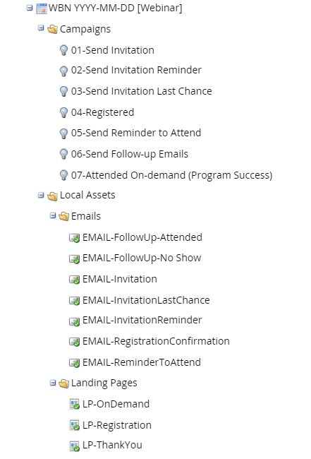

# Best Practice: How to Organize your Programs {#best-practice-how-to-organize-your-programs}

There are many ways to organize the tree in Marketing Activities as well as the contents of a single program. However, some ways are better and will help people in your marketing department.

>[!TIP]
>
>One day, (when you get promoted!) someone else will be trying to make sense of your programs. Good organization will help them be productive quickly.

## Folders {#folders}

In Marketing Activities, you should use folders to organize your programs. The structure we recommend is in the following example:

>[!NOTE]
>
>**Example**
>
>* Active Marketing Programs  
>
>    * Emails
>    * Events  
>
>        * Live Events / Roadshows
>        * Tradeshows
>        * Webinars
>
>    * Newsletters
>    * Nurture
>    * Web Content
>    * Web Forms
>
>* Learning
>* Operational  
>
>    * Lifecycle
>    * Scoring
>    * Data Management
>
>* Sales Insight >
>    * Interesting Moments
>    * Sales Emails
>    * Sales Requested Campaigns
>
>* **Archive** >
>    * Archive Events >
>        * Archive 2012
>        * Archive 2013
>

Each of these mentioned in the example is a folder. Notice how they are all uniquely named. You can have duplicate (simpler) names of folders INSIDE programs, but not at the root of the tree. 

>[!TIP]
>
>The "Archive" folder is a special kind of folder that is designed to remove items from select lists as well as reporting. This will help your system run quicker. Learn [more about folders](../../../../product-docs/core-marketo-concepts/miscellaneous/understanding-folders.md).

You can certainly add more folders as you see fit. Just keep in mind that future generations of marketers in your company will live with your decisions about how to name/organize things.  

## Naming Schemes {#naming-schemes}

Naming is critical, as Marketo's features all use a common language to communicate. For programs, you should name them something unique. **No two programs can have the same name**. Best practice is to use the following format:

[Abbreviation of Program Type] [YYYY]-[MM]-[Optional DD] [Brief Description]

>[!NOTE]
>
>**Example**
>
>Example program names:
>
>1. ES 2015-09-21 Widget Intro
>1. NL 2015-06 Newsletter
>1. WBN 2015-12-01 Webinar Topic Here
>

Program names need to be unique in your subscription, even in different [workspaces](../../../../product-docs/administration/workspaces-and-person-partitions/understanding-workspaces-and-person-partitions.md).  For the local assets inside programs, the rule is to **keep the name simple**. Just name an invitation "Invitation," as opposed to "2015 June Webinar Invitation." Because these are in a program, the parent program is automatically part of the name when choosing it elsewhere. In other words, local assets only need to be unique inside the program. You can have hundreds of assets named "Invite," each in a different program and it won't mess you up.

## Tokens {#tokens}

Tokens use folders and programs as a vehicle to set variables to be used by landing pages, emails and other assets. Learn [all about tokens](http://docs.marketo.com/display/docs/tokens).

The organization mentioned above allows you to put tokens in the Event folder so that it cascades down into all events.

>[!NOTE]
>
>**Example**
>
>**Your corporate address**. Use a token rather than writing it every single time. That way you can update it in one spot without needing to create lots of drafts. Then override the token as needed in a lower level folder.

## Events {#events}

An Event usually has a lot of moving parts, including: invitations, landing pages, forms, social widgets, and smart campaigns. The best practice to organize them for ease of use is by the phase of the Event. Here is an example of how your folder tree should look for an Event.

## Engagement Programs {#engagement-programs}

Learn [all about engagement programs](../../../../product-docs/email-marketing/drip-nurturing/creating-an-engagement-program/understanding-engagement-programs.md). The best way to organize your engagement program is with folders. Make a folder for each stream and then put the emails or programs into that folder. Include an archive folder in each stream when content gets stale and you want to remove it.

## Operational Programs {#operational-programs}

These are used for data cleanup purposes. Have folders for the dates that the programs were run and then archive the folders. By making the program operational, you are omitting it from reporting, which is good for this kind of activity.

## Nesting Email Programs {#nesting-email-programs}

Email Programs are designed to be your tool for mail blasting. You can put them inside Events or other programs for promotions, invitations and reminders. They come with a cool dashboard and other A/B testing features. Additionally, they are easily manipulated in the [program schedule view](http://docs.marketo.com/display/docs/program+schedule+view).

You can also make an email program as a stand-alone program. Email programs are not allowed inside other email programs. That would be crazy!

## Cloning {#cloning}

One of the coolest features in Marketo is the ability to clone programs. This means you can setup a program "template" that has all the smart campaigns and emails you want. Set it up in advance and then clone it for your next marketing initiative.

>[!TIP]
>
>Notice the Event Templates in the example at the top. Put your different types of events in there for easy cloning.

Some people even abstract most of the text in the emails and landing pages into tokens. This allows you to clone and then edit the tokens. Finally, go to the program schedule view and adjust the dates and you are finished. Voila!  

## Summary {#summary}

As you can see, there is a lot of power in Marketo. We covered the basics here, but consider some [additional services from Marketo Experts](http://www.marketo.com/services/) to fine tune and set yourself up for success.
