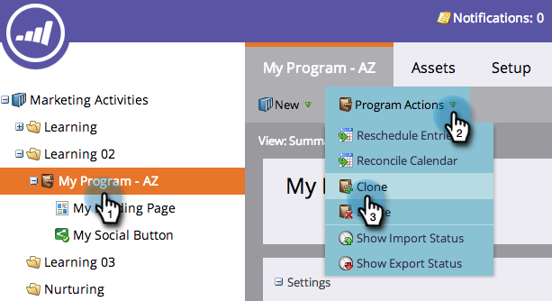
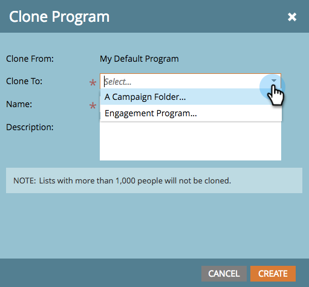
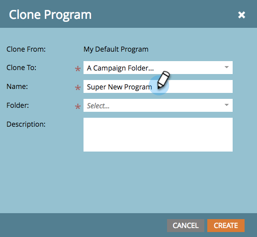
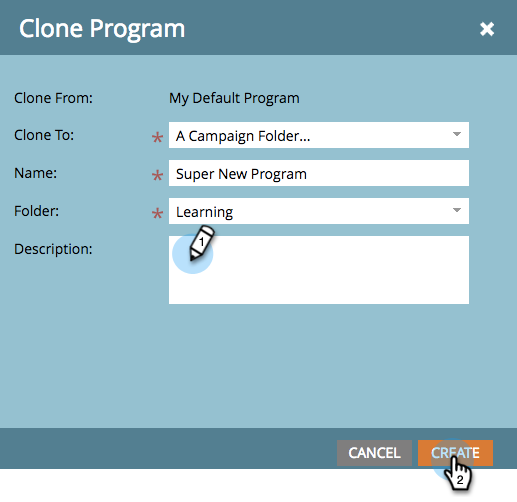

# Clone a Program {#clone-a-program}

Quickly and easily clone an entire program and all its assets instead of manually rebuilding everything.

>[!PREREQUISITES]
>
>Before diving in, learn about [best practices for avoiding corruption in cloned assets](https://nation.marketo.com/t5/Knowledgebase/Avoiding-Corruption-in-Cloned-Assets/ta-p/249729).

1. Find and select the program you want to clone, then under **Program Actions** click **Clone**.

   

1. Select where you want to clone your program to.

   >[!NOTE]
   >
   >Programs can be cloned into [campaign](/help/marketo/product-docs/core-marketo-concepts/miscellaneous/create-new-campaign-folder.md) [folders](/help/marketo/product-docs/core-marketo-concepts/miscellaneous/create-new-campaign-folder.md) or [workspaces](/help/marketo/product-docs/administration/workspaces-and-person-partitions/create-a-new-workspace.md). Make sure you share all underlying dependent assets (emails, snippets, landing page templates, etc.) with the destination workspace before cloning.

   

   >[!NOTE]
   >
   >See that NOTE in the screenshot above? It means if you clone a program with 1000 or more people in a list, the list itself will get cloned, but it will be empty. If you clone a program with a list that contains 999 people or less, that list, along with all of its members, will show up in the cloned program.

1. Enter a Name.

   

1. Choose the folder you'd like to clone your program to.

   

1. Add an optional description, then click **Create**. Look how quickly you were able to create a new program with all its assets ready to go!

   

   >[!TIP]
   >
   >Use this technique along with tokens to make new program creation a snap.

   >[!CAUTION]
   >
   >Period costs will not transfer over, so be sure to add that to your cloned program if you had one set in the original.
