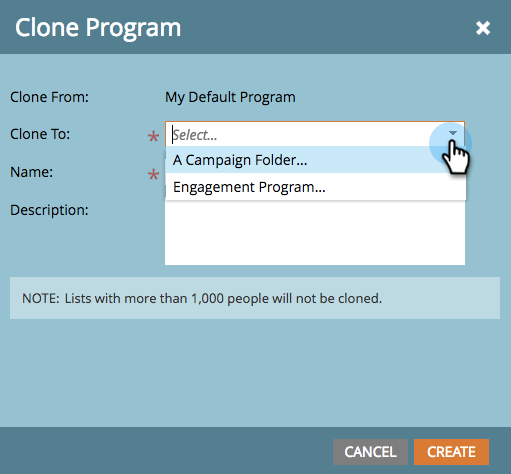

# Clone a Program {#clone-a-program}

Clone an entire program and all its assets instead of manually rebuilding everything.

1. Find and select the program you want to clone. In the **[!UICONTROL Program Actions]** drop-down, click **[!UICONTROL Clone]**.

   

1. Select where you want to clone your program to.

   >[!NOTE]
   >
   >Programs can be cloned into [campaign](/help/marketo/product-docs/core-marketo-concepts/miscellaneous/create-new-campaign-folder.md) [folders](/help/marketo/product-docs/core-marketo-concepts/miscellaneous/create-new-campaign-folder.md) or [workspaces](/help/marketo/product-docs/administration/workspaces-and-person-partitions/create-a-new-workspace.md). Ensure all underlying dependent assets (emails, snippets, landing page templates, etc.) are shared with the destination workspace before cloning.

   

   >[!NOTE]
   >
   >See that [!UICONTROL NOTE] in the screenshot above? It means if you clone a program with 1000 or more people in a list, the list itself will get cloned, but it will be empty. If you clone a program with a list that contains 999 people or less, that list, along with all of its members, will show up in the cloned program.

1. Enter a **[!UICONTROL Name]**.

   

1. Choose the destination folder.

   

1. Add an optional description, then click **[!UICONTROL Create]**.

   

   >[!TIP]
   >
   >Use this technique along with tokens to make new program creation faster.

   >[!CAUTION]
   >
   >Period costs will not transfer over, so ensure that is added to the cloned program if one was set in the original.
