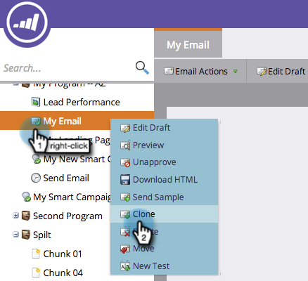
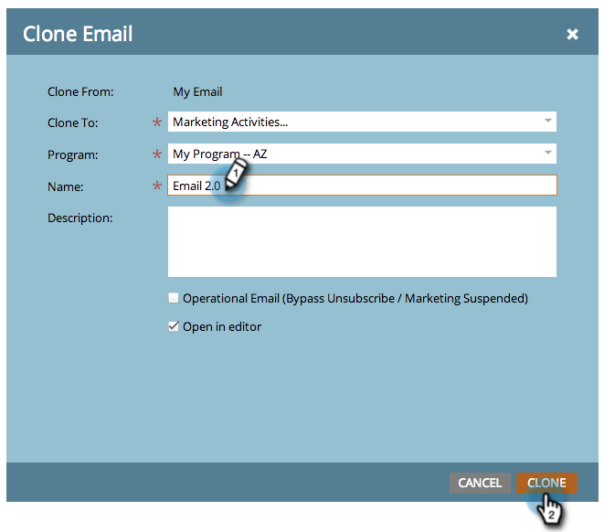
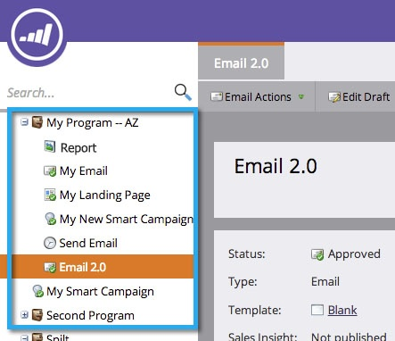

# Clone an Asset in a Program {#clone-an-asset-in-a-program}

Cloning a program clones _everything_. Sometimes you just want to clone one asset. Here's how.

>[!NOTE]
>
>You'll need to perform additional steps to [clone a landing page test group](/help/marketo/product-docs/demand-generation/landing-pages/landing-page-actions/cloning-a-landing-page-test-group.md).

## Clone a Local Asset {#clone-a-local-asset}

1. Go to **Marketing** **Activities**.

   

1. Select your program.

   

1. Right-click the local asset you want to clone. Click **Clone**.

   

1. Each kind of asset presents a different dialog box. Simply fill out the info and click **Clone**.

   

   >[!TIP]
   >
   >You can also clone an asset to a different program. Use the **Program** drop-down to make your selection.

1. Great! You should now see the new cloned asset.

   

   >[!NOTE]
   >
   >[Clone a Program](/help/marketo/product-docs/core-marketo-concepts/programs/working-with-programs/clone-a-program.md)
