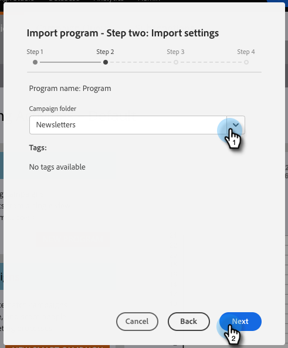
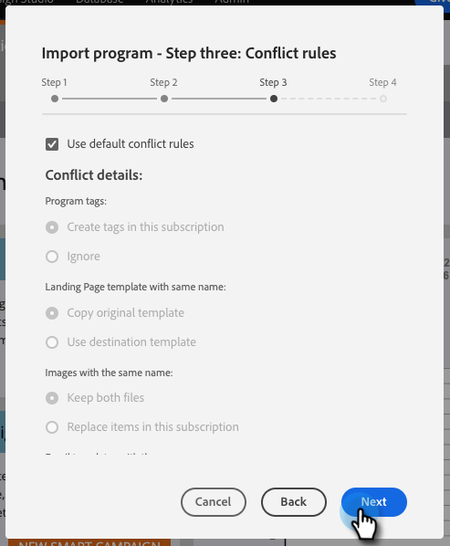
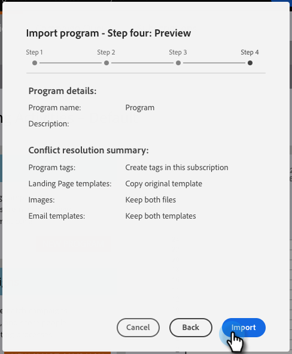

# Import a Program {#import-a-program}

A program can be imported from one Marketo Engage subscription to another. For instance, you can create a program in a sandbox and then import it into your live subscription. Also, you can import a pre-built program from the [Marketo Program Library](/help/marketo/product-docs/core-marketo-concepts/programs/program-library/program-import-library-overview.md){target="_blank"}.

>[!CAUTION]
>
>
>* When importing a program, emails/Landing Pages that contain snippets or [dynamic content](/help/marketo/product-docs/personalization/segmentation-and-snippets/segmentation/understanding-dynamic-content.md){target="_blank"} will be skipped.
>
>* Programs that have Smart Lists containing a "Custom Object is Updated" trigger will cause the import to fail. Please remove this trigger from all Smart Lists prior to following the steps outlined below.

## Importing a Program {#importing-a-program}

1. Go to **[!UICONTROL Marketing Activities]**.

   

1. Click the **[!UICONTROL New]** drop-down and select **[!UICONTROL Import Program]**.

   

   >[!NOTE]
   >
   >* Program Import is only available for users that have roles with Import Program permission enabled. Learn more about [managing user roles and permissions](/help/marketo/product-docs/administration/users-and-roles/managing-user-roles-and-permissions.md){target="_blank"}.
   >
   >* To connect a sandbox account to your live subscription, contact [Marketo Support](https://nation.marketo.com/t5/Support/ct-p/Support){target="_blank"}.

1. Select a Marketo **[!UICONTROL Subscription]** and a program to import. Click **[!UICONTROL Next]**.

   

1. Specify a **[!UICONTROL Campaign Folder]** for the imported program. Click **[!UICONTROL Next]**.

   

   >[!NOTE]
   >
   >Make sure **[!UICONTROL Use default conflict]** rules is selected. Conflict rules are needed when you import programs into an instance that have assets of the same name.

1. Choose your desired Conflict Details and click **[!UICONTROL Next]**.

   

   >[!NOTE]
   >
   >Importing a program that uses Custom Flow Steps, or Smart List rules that are derived from a Flow Step Service into a destination instance where there is more than one compatible service provider, the importing user will be prompted to assign steps or rules to the correct service provider in the destination instance.

1. Preview details and **[!UICONTROL Import]** the program.

   

An email confirmation is sent once the import has finished.

   >[!NOTE]
   >
   >You'll need to reschedule imported batch campaigns and activate trigger campaigns. The system automatically deactivates campaign schedules and trigger campaigns in the imported program.

## Impact on External Assets During Program Imports {#impact-on-external-assets-during-program-imports}

Programs use external assets like email templates, Landing Page templates, images, forms, tokens, and program tags. You have the ability to configure how Landing Page templates and program tags are handled, and Marketo automatically manages the rest.

**Email/Landing Page Templates:** Email/Landing Page templates are imported into the Design Studio. You can use conflict rules to configure behavior when a template with the same name exists. Using the default rule, a number will be appended to a template if one with the same name exists. For example, if you already have a template named "Standard Template," the new one will be named "Standard Template - 1."

**Landing Pages/Forms:** If a form or Landing Page with the same name exists in Design Studio, they will still be imported, but with a number appended to their name (ex: Landing Page - 1).

**Images:** Images used by Landing Pages are imported into the design studio unless one with the same name exists.

**Tokens:** Tokens that live outside of a program will be converted to local tokens during the import process.

>[!CAUTION]
>
>Image type my tokens are not supported for program imports. If a program that has image type my tokens is imported, _no_ tokens will come through.

**Program Tags:** You can use conflict rules to control how program tags that do not exist in the destination account will be treated. Using the default rule will create the program tags, or you can choose to ignore the tags.
