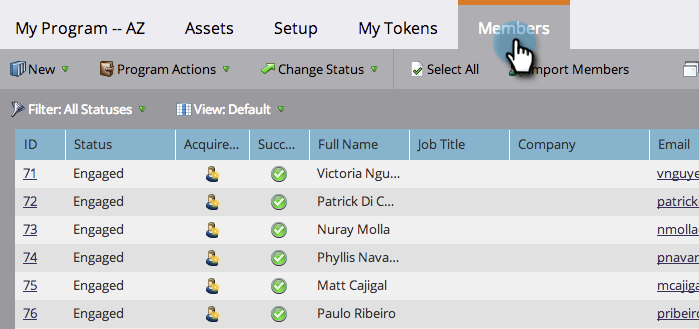
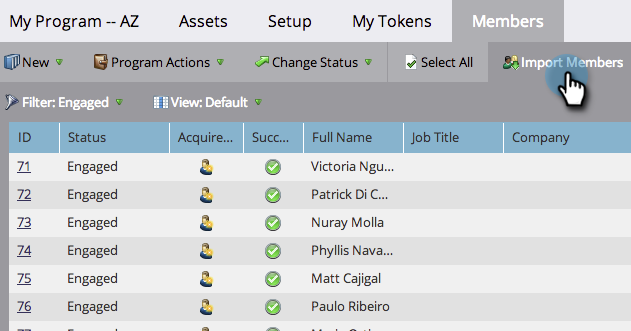
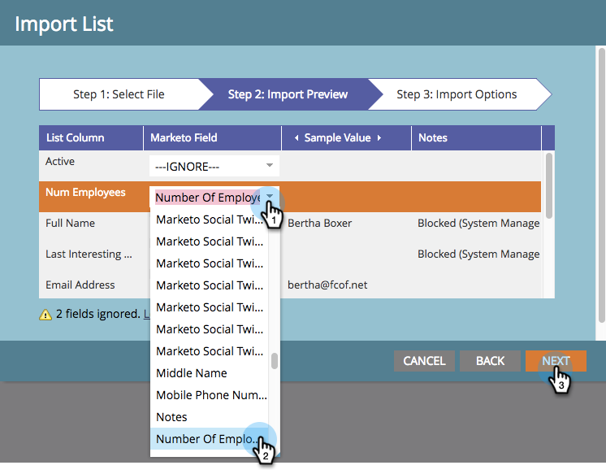
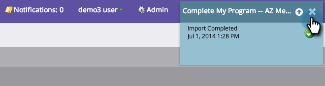
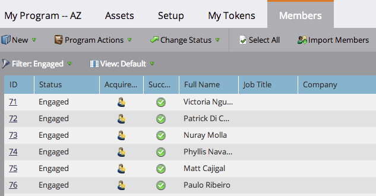

# Import Members from a Spreadsheet into a Program {#import-members-from-a-spreadsheet-into-a-program}

You can import a list of people who automatically become members of a program. Here's what to do.

## Prepare Your CSV file {#prepare-your-csv-file}

1. Create a standard CSV file in Excel, like the example below.

   

   >[!CAUTION]
   >
   >When importing a date into a date field, use this format:&nbsp;9/23/13&nbsp;(Month/Day/Year).

## Import Your CSV into Marketo {#import-your-csv-into-marketo}

1. In your program, go to the **Members**&nbsp;section.

   

1. Click **Import Members**.

   

1. Select the CSV and click **Next**.

   

1. Map the data values from the list to their corresponding Marketo Fields and click **Next**.

   

   >[!NOTE]
   >
   >If there are any fields you don't want to import, select&nbsp;**IGNORE**&nbsp;in the Marketo Field drop-down menu.

1. Select the **Member Status** for your list.

   

1. Click **Import**.

   

1. Wait for Marketo to finish importing, then close the confirmation dialog.

   

   Great! You should see the new members you imported.

   

>[!NOTE]
>
>**Related Articles**
>
>* [Manage and View Members](manage-and-view-members.md)
>

