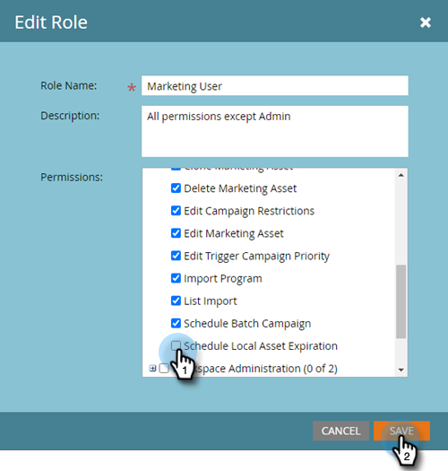
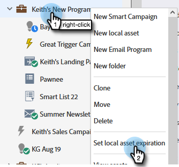
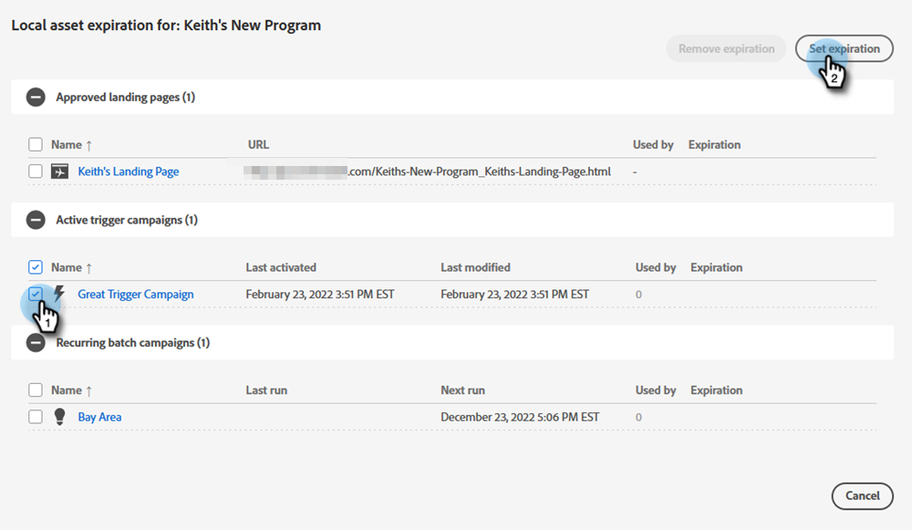
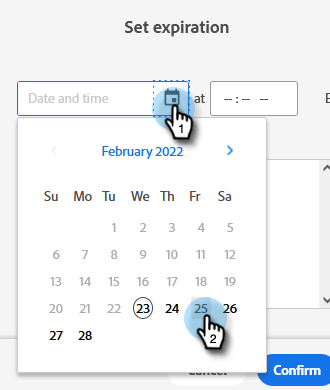
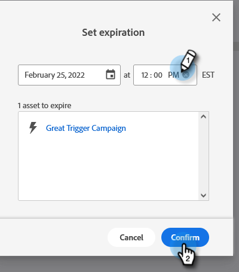
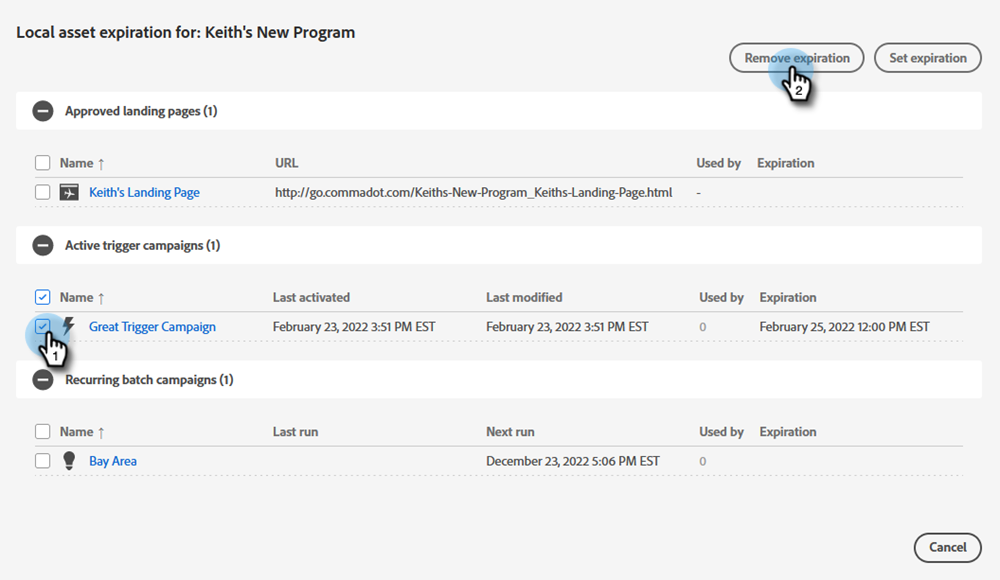
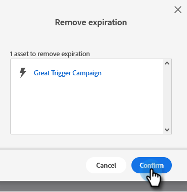

# Local Asset Expiration {#local-asset-expiration}

Set an expiration date/time to unpublish landing pages, deactivate trigger campaigns, or stop recurring batch campaigns.

## Grant Schedule Asset Expiration Permission {#grant-schedule-asset-expiration-permission}

Before you can schedule an asset expiration, your Marketo role must have the proper permission enabled.

>[!NOTE]
>
>**Admin Permissions Required**

1. In the [!UICONTROL Admin] area, click **[!UICONTROL Users & Roles]**.

   

1. Click the **[!UICONTROL Roles]** tab, select the user you want to grant access to, then click **[!UICONTROL Edit Role]**.

   

1. Under [!UICONTROL Access Marketing Activities], select **[!UICONTROL Schedule Local Asset Expiration]** and click **[!UICONTROL Save]**.

   

## Set an Expiration Date {#set-an-expiration-date}

1. Right-click on your desired program and select **[!UICONTROL Set Local Asset Expiration]**.

   

1. Check the asset(s) you want to set an expiration date for, then click **[!UICONTROL Set Expiration]**.

   

1. Choose an expiration date.

   

1. Set a time. You must schedule a time at least 20 minutes in the future (don't forget to enter AM/PM). Click **[!UICONTROL Confirm]** when done.

   

>[!NOTE]
>
>* To edit an existing expiration date, simply check the asset(s) and click **[!UICONTROL Set Expiration]**.
>* Once an asset has expired, it will no longer show up on the Expiration grid. The grid will only display published landing pages, active trigger campaigns, and recurring batch campaigns.
>* Scheduled expirations will be removed if the asset is moved to another program.

## Remove an Expiration Date {#remove-an-expiration-date}

1. To remove an expiration date, check the asset(s) and click **[!UICONTROL Remove Expiration]**.

   

1. Review the assets being affected, then click **[!UICONTROL Confirm]**.

   

>[!NOTE]
>
>Expiration dates that are less than 15 minutes into the future cannot be removed. To "remove" the expiration, you'll need to wait for the asset to expire, then re-approve or re-activate it.
