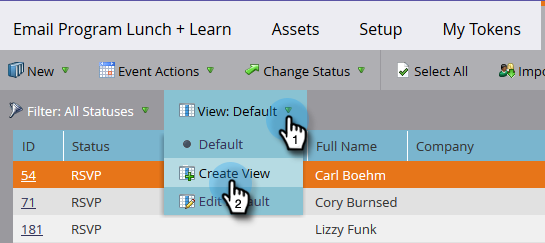

# Manage and View Members {#manage-and-view-members}

You can manage and view your members in your programs using the Members tab.

>[!NOTE]
>
>Dive deeper into [program membership](/help/marketo/product-docs/core-marketo-concepts/programs/creating-programs/understanding-program-membership.md){target="_blank"}.

## Search for a Member {#search-for-a-member}

At the bottom of the Members section, use the search field to search for program members by name, email, job title, or company.

1. Click the **[!UICONTROL Members]** tab of your program.

   

1. Use the search field to search the list of members.

   

## Export the Members Grid {#export-the-members-grid}

You can export your member list by clicking the Excel icon next to the search field.

## Manage Columns in the Members Grid {#manage-columns-in-the-members-grid}

Drag and drop columns to change their order. The pair of blue arrows indicate where the column will go.

  

Right-click the column header to sort alphabetically, either ascending or descending.

  

## Choose Which Columns are Visible in the Grid {#choose-which-columns-are-visible-in-the-grid}

1. Click the **[!UICONTROL View]** drop-down and select **[!UICONTROL Create View]**.

   

1. Name your custom view. Select column titles. Click **[!UICONTROL Add]** and **[!UICONTROL Remove]** to move columns and create a view.

   

1. Click **[!UICONTROL Create]**.

   

## Filter the Members Grid  {#filter-the-members-grid}

1. Click the **[!UICONTROL Filter]** drop-down and select a progression step to sort by.

   

## Manage Person Status in the Members Grid {#manage-person-status-in-the-members-grid}

You can change the status of your people inside the members grid.

1. Hold down **[!UICONTROL Ctrl/Cmd]** and select the people.

   

1. Click the **[!UICONTROL Change Status]** drop-down and select a status.

   

   This may take a moment. You'll see the message below when it's all done!

   

So many features, but they're all pretty straightforward. Enjoy!

>[!MORELIKETHIS]
>
>[Create a Program Performance Report](/help/marketo/product-docs/core-marketo-concepts/programs/program-performance-report/create-a-program-performance-report.md){target="_blank"}
