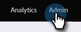
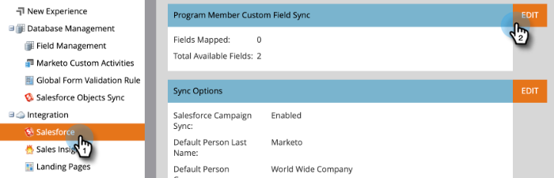
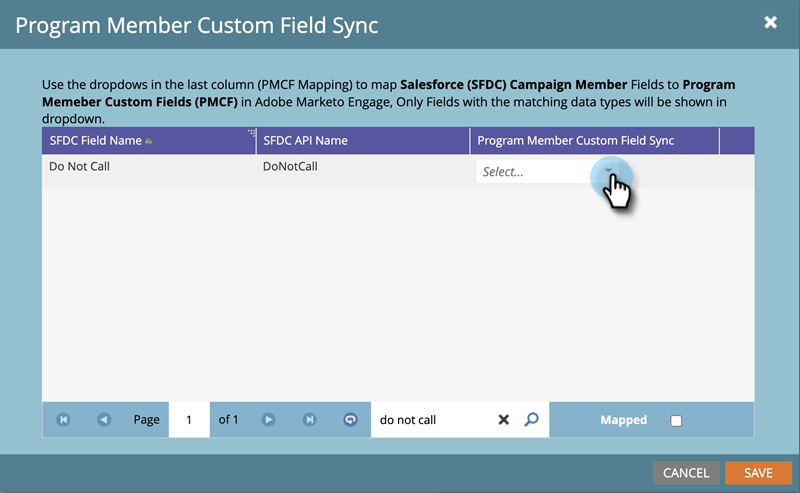
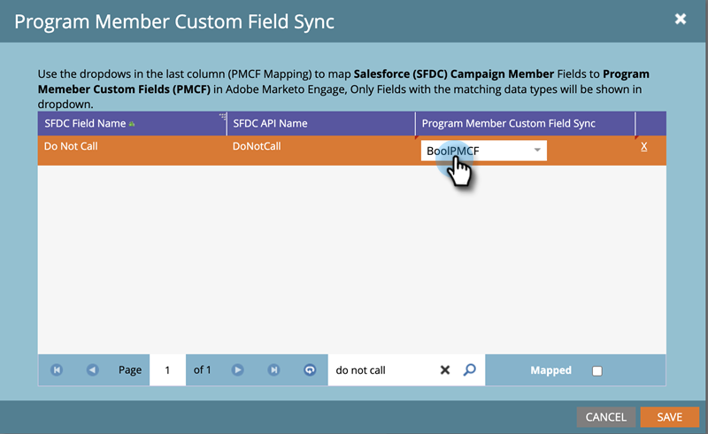
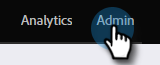
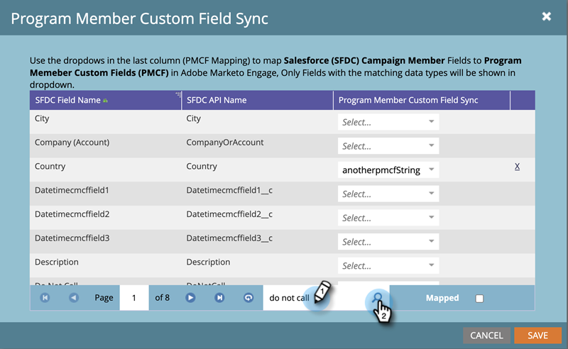
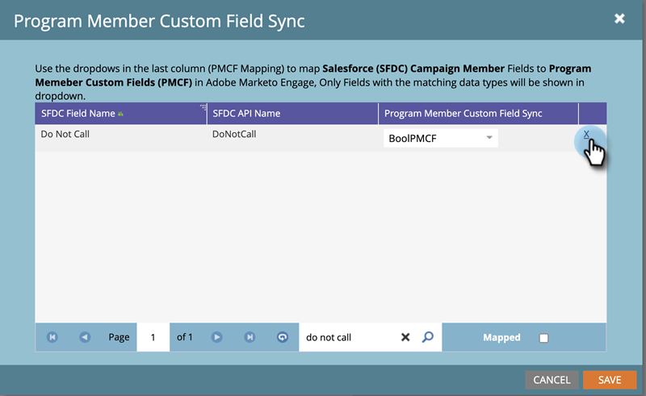

# Program Member Custom Field Sync {#program-member-custom-field-sync}

>[!PREREQUISITES]
>
>* Creation of [Program Member Custom Fields](/help/marketo/product-docs/core-marketo-concepts/programs/working-with-programs/program-member-custom-fields.md){target="_blank"}
>* [Sync a Salesforce Campaign with a Program](/help/marketo/product-docs/core-marketo-concepts/programs/working-with-programs/sync-an-sfdc-campaign-with-a-program.md){target="_blank"}

>[!NOTE]
>
>The Program Member object can have up to 20 custom fields. Those fields are available to any program.

## Map Salesforce Fields to Program Member Custom Fields {#map-salesforce-fields-to-program-member-custom-fields}

1. In Marketo, click **Admin**.

   
 
1. Click **Salesforce**, then click **Edit** next to Program Member Custom Field Sync.

   
 
1. Use the search box to locate the Salesforce fields you want to map. In this example, we're using Do Not Call.

   

1. Click the drop-down.

   

1. Choose the desired Marketo Program Member Custom Field to map.

   

   >[!NOTE]
   >
   >The drop-down will only show Program Member Custom Fields that match the data type of the Salesforce field.

1. For additional field mappings, clear the search box and repeat steps 3 through 5.

1. Click **Save** when done.

   

   >[!IMPORTANT]
   >
   >Changes to program member data on the mapped fields will be synced between Marketo and Salesforce going forward.

   >[!NOTE]
   >
   >If you rename or change the data type of a field in Salesforce, we will remove any mapping of that field with the Program Member Custom Field. But you can remap it with the new field after review.

## Unmap Salesforce Fields from Program Member Custom Fields {#unmap-salesforce-fields-from-program-member-custom-fields}

If you ever want to free up a field in order to replace it, or just make a general change, you must perform an unmapping first. Here's how.

1. In Marketo, click **Admin**.

   

1. Click **Salesforce**, then click **Edit** next to Program Member Custom Field Sync.

   

1. Use the search box to locate the field(s) you want to unmap. In this example, we're using Do Not Call.

   

   >[!TIP]
   >
   >You can select the **Mapped** checkbox to see only mapped fields.

1. Unmap by clicking the **X** next to the field.

   

1. The mapping is now removed. Click **Save**.

   

## Data Type Mapping {#data-type-mapping}

<table>
  <colgroup>
    <col/>
    <col/>
  </colgroup>
  <tbody>
    <tr>
      <th>SFDC Data Type</th>
      <th>Program Member Custom Field Data Type</th>
    </tr>
    <tr>
      <td>Text</td>
      <td>String</td>
    </tr>
    <tr>
      <td>Picklist</td>
      <td>String</td>
    </tr>
    <tr>
      <td>Multi-select Picklist</td>
      <td>String</td>
    </tr>
    <tr>
      <td>Phone</td>
      <td>String</td>
    </tr>
    <tr>
      <td>Email</td>
      <td>String</td>
    </tr>
    <tr>
      <td>Number(m)</td>
      <td>Integer</td>
    </tr>
    <tr>
      <td>Number(m,n)</td>
      <td>Float</td>
    </tr>
    <tr>
      <td>Checkbox</td>
      <td>Boolean</td>
    </tr>
    <tr>
      <td>URL</td>
      <td>URL</td>
    </tr>
    <tr>
      <td>Date</td>
      <td>Date</td>
    </tr>
    <tr>
      <td>Datetime</td>
      <td>Datetime</td>
    </tr>
    <tr>
      <td>Lookup (reference)</td>
      <td>String</td>
    </tr>
    <tr>
      <td>Base64</td>
      <td>String</td>
    </tr>
  </tbody>
</table>

>[!MORELIKETHIS]
>
>* [Change Program Member Data](/help/marketo/product-docs/core-marketo-concepts/smart-campaigns/program-flow-actions/change-program-member-data.md){target="_blank"}
>* [View data on the Program Member grid](/help/marketo/product-docs/core-marketo-concepts/programs/working-with-programs/manage-and-view-members.md){target="_blank"}
>* [SFDC Sync - Campaign Sync](/help/marketo/product-docs/crm-sync/salesforce-sync/sfdc-sync-details/sfdc-sync-campaign-sync.md){target="_blank"}
