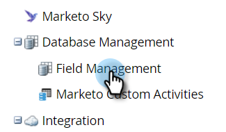

# Program Member Custom Fields {#program-member-custom-fields}

Program member custom fields allow you to collect program-specific data for each member. They can be used in: Marketo forms, Smart List filters and triggers, and Smart Campaign flow actions. The data is viewable in the program's Members tab.

## Create a Program Member Custom Field {#create-a-program-member-custom-field}

1. In Marketo, click **Admin**.

   

1. Click **Field Management**.

   

1. Click **New Custom Field**.

   

1. Click the Object drop-down and select the desired object.

   

   >[!NOTE]
   >
   >Person and Program Member custom fields cannot share the same name.

1. Fill out the remaining fields and click **Create**.

   

   >[!NOTE]
   >
   >Types supported for Program Member custom fields are: boolean, date, datetime, float, integer, string, URL. [Learn more about field types](http://docs.marketo.com/x/Wwgt).

## Object Descriptions {#object-descriptions}

| Object |Description |
|---|---|
| Company |The name of the company associated with the person. |
| Opportunity |An opportunity can be associated with a person or account as a potential future sale. They usually enter Marketo through a CRM, or via API. |
| Person |An individual in your Marketo database that you're engaging with through marketing campaigns. |
| Program Member |Person who is also a member of a program |

## Triggers and Filters {#triggers-and-filters}

You can leverage this program-specific data in smart lists via [triggers](http://docs.marketo.com/x/PoAR)and/or [filters](http://docs.marketo.com/x/2YAI).

## Things to Know {#things-to-know}

##### Program Member custom fields are available in local assets only. They are not supported in Design Studio because there's no way to tie it to a specific program. {#program-member-custom-fields-are-available-in-local-assets-only-they-are-not-supported-in-design-studio-because-theres-no-way-to-tie-it-to-a-specific-program}

##### You cannot clone/move a form (or a landing page with a form) that contains Program Member custom fields to the Design Studio. {#you-cannot-clone-move-a-form-or-a-landing-page-with-a-form-that-contains-program-member-custom-fields-to-the-design-studio}

##### Program Member custom fields cannot be used as tokens. {#program-member-custom-fields-cannot-be-used-as-tokens}

##### The Program Member object can have up to 20 custom fields. Those fields are available to any program. {#the-program-member-object-can-have-up-to-custom-fields-those-fields-are-available-to-any-program}

##### When you remove a member of a program, if they have any data in their Program Member custom field, the data will be scrubbed from that field. {#when-you-remove-a-member-of-a-program-if-they-have-any-data-in-their-program-member-custom-field-the-data-will-be-scrubbed-from-that-field}

##### To view the data, click the Members tab in the program and create a custom view that includes said field(s). {#to-view-the-data-click-the-members-tab-in-the-program-and-create-a-custom-view-that-includes-said-field-s}

##### Import and export via [list](http://docs.marketo.com/x/egAk)and [API](http://developers.marketo.com/)are supported. {#import-and-export-via-list-and-api-are-supported}

##### When you merge two people, the winner’s Program Member custom field data will be used. But if the winner has none, the loser’s value will be used. {#when-you-merge-two-people-the-winner-s-program-member-custom-field-data-will-be-used-but-if-the-winner-has-none-the-loser-s-value-will-be-used}

>[!NOTE]
>
>**Related Articles**
>
>[Create a Custom Field in Marketo](../../../../product-docs/administration/field-management/create-a-custom-field-in-marketo.md)

