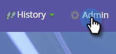

# Program Member Custom Fields {#program-member-custom-fields}

Program Member custom fields allow you to collect program-specific data for each member. They can be used in: Marketo forms, Smart List filters and triggers, and Smart Campaign flow actions. The data is viewable in the program's Members tab.

>[!NOTE]
>
>Program Member custom fields do not have an integration with [!DNL Salesforce] Campaign Member fields at this time.

## Create a Program Member Custom Field {#create-a-program-member-custom-field}

1. In Marketo, click **[!UICONTROL Admin]**.

   

1. Click **[!UICONTROL Field Management]**.

   

1. Click **[!UICONTROL New Custom Field]**.

   

1. Click the **[!UICONTROL Object]** drop-down and select the desired object.

   

   >[!NOTE]
   >
   >[!UICONTROL Person] and [!UICONTROL Program Member] custom fields cannot share the same name.

1. Fill out the remaining fields and click **[!UICONTROL Create]**.

   

   >[!NOTE]
   >
   >Types supported for [!UICONTROL Program Member] custom fields are: boolean, date, datetime, float, integer, string, URL. [Learn more about field types](/help/marketo/product-docs/administration/field-management/custom-field-type-glossary.md){target="_blank"}.

## Object Descriptions {#object-descriptions}

| Object |Description |
|---|---|
| Company |The name of the company associated with the person. |
| Opportunity |An opportunity can be associated with a person or account as a potential future sale. They usually enter Marketo through a CRM, or via API. |
| Person |An individual in your Marketo database that you're engaging with through marketing campaigns. |
| Program Member |Person who is also a member of a program |

## Triggers and Filters {#triggers-and-filters}

You can leverage this program-specific data in smart lists via [triggers](/help/marketo/product-docs/core-marketo-concepts/smart-campaigns/creating-a-smart-campaign/define-smart-list-for-smart-campaign-trigger.md){target="_blank"} and/or [filters](/help/marketo/product-docs/core-marketo-concepts/smart-lists-and-static-lists/creating-a-smart-list/find-and-add-filters-to-a-smart-list.md){target="_blank"}.

## Things to Know {#things-to-know}

* Program Member custom fields are available in local assets only. They are not supported in Design Studio because there's no way to tie it to a specific program.
* You cannot clone/move a form (or a landing page with a form) that contains Program Member custom fields to the Design Studio.
* The Program Member object can have up to 20 custom fields. Those fields are available to any program.
* When you remove a member of a program, if they have any data in their Program Member custom field, the data will be scrubbed from that field.
* To view the data, click the Members tab in the program and create a custom view that includes said field(s).
* Import and export via [list](/help/marketo/getting-started/quick-wins/import-a-list-of-people.md){target="_blank"} and [API](https://developers.marketo.com/){target="_blank"} are supported. Exports work on Program Member lists only, not static lists.
* When you merge two people, the winner’s Program Member custom field data will be used. But if the winner has none, the loser’s value will be used.
* Change type is not allowed on Program Member Info fields.
* The "contains" Smart List constraint is not supported for Program Member custom fields.

>[!MORELIKETHIS]
>
>[Create a Custom Field in Marketo](/help/marketo/product-docs/administration/field-management/create-a-custom-field-in-marketo.md){target="_blank"}
