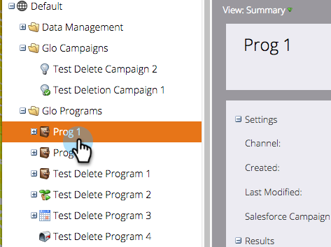
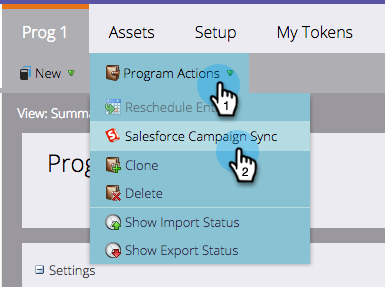
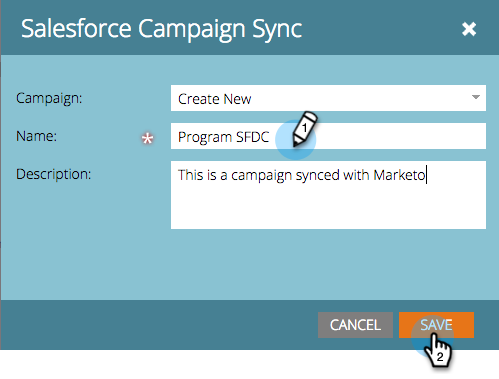
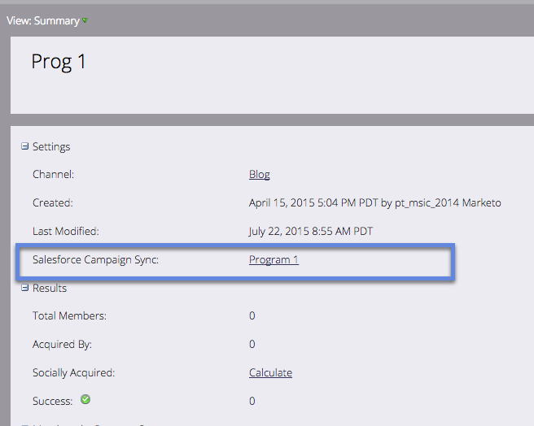

# Sync an SFDC Campaign with a Program {#sync-an-sfdc-campaign-with-a-program}

Marketo allows you to sync your programs with Salesforce campaigns to maintain the same list of people in both systems, including their statuses. Let's get started!  

>[!PREREQUISITES]
>
>You will need to [enable Salesforce campaign sync](../../../../product-docs/crm-sync/salesforce-sync/setup/optional-steps/enable-disable-campaign-sync.md) first.

>[!CAUTION]
>
>When syncing an SFDC campaign with a Marketo program, the implied SFDC actions (e.g., add to SFDC Campaign, Sync to SFDC) will be disabled for child campaigns of the program.

1. Go to **Marketing Activities**.

   

1. Select your program.

   

1. Click **Program Actions**, then select **Salesforce Campaign Sync**.

   

1. Select **Create New **or choose an existing Salesforce campaign.

   >[!TIP]
   >
   >If you select an existing Salesforce campaign, make sure to [match the program statuses of the Salesforce campaign and the Marketo program](../../../../product-docs/crm-sync/salesforce-sync/sfdc-sync-details/sfdc-errors/how-to-match-program-statuses-and-salesforce-campaign-statuses-prior-to-sync.md).

1. Enter a name for the new campaign and click **Save**.

   

1. Now you can verify the campaign sync details in the program summary page.

   

   Excellent! Now any program status changes in Marketo are synced to the SFDC campaign and vice versa.

