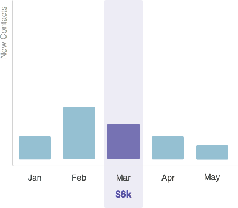
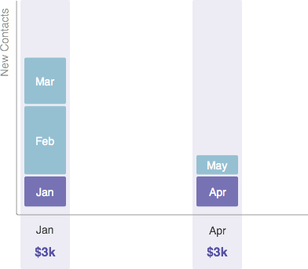

# Understanding Period Costs {#understanding-period-costs}

## Overview {#overview}

Period costs refer to the money you spend in a specific month on a program.

>[!NOTE]
>
>**Example**
>
>If you spend $1000 to hire an illustrator for an eBook that launches in July - the eBook program would have a period cost of $1000 in July.
>
>If you spend $200 per month on Google Adwords - the Google Adwords program would have a period cost of $200 **every month**.

>[!NOTE]
>
>[Understanding Programs](/help/marketo/product-docs/core-marketo-concepts/programs/creating-programs/understanding-programs.md)
>
>[Understanding Program Membership](/help/marketo/product-docs/core-marketo-concepts/programs/creating-programs/understanding-program-membership.md)

## How Period Costs are Calculated {#how-period-costs-are-calculated}

Imagine an event, like a webinar, that occurs in March. New people are acquired beforehand from advertising in January and February. New contacts are also acquired after the event, when people download the webinar in the months of April and May.

1. With a single period cost attributed to March...

   

   ...contacts added in the months before and after will *only* count towards March.

   

1. With period costs attributed to January, February, and March...

   

   ...contacts added only in the months after March will count towards March.

   

1. With period costs attributed to January and April...

   

   ...contacts added in the months January through March will count towards January. Contacts added in the months April and May will count towards April.

   

   >[!NOTE]
   >
   >In summary - months with no defined period costs will roll "backwards" to the last one that was defined. If there is no prior period cost, the months will be rolled "forward" to the next one that has been defined. If a period cost has not been defined for _any_ months, reporting in RCE will not be available for the program.

   >[!MORELIKETHIS]
   >
   >* [Using Period Costs in a Program](/help/marketo/product-docs/core-marketo-concepts/programs/working-with-programs/using-period-costs-in-a-program.md)
   >* [Filter a Program Report by Period Cost](/help/marketo/product-docs/core-marketo-concepts/programs/program-performance-report/filter-a-program-report-by-period-cost.md)
