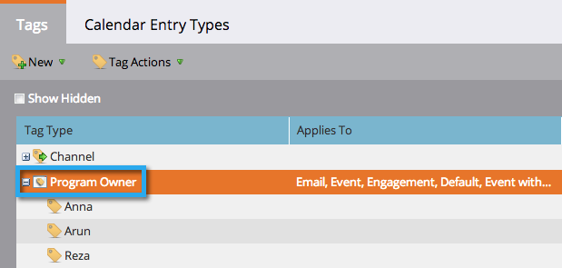

# Understanding Tags {#understanding-tags}

You probably know by now that programs are like building blocks in Marketo. Utilizing tags and channels will assist you in filtering data for reporting purposes.

Tags are used to describe programs. You can make as many as you need, each with unique values. Channels identify the delivery mechanism in a program, such as webinar, sponsorship, or online ad.

## Tag Type {#tag-type}

Tag types identify the kind of information you want to sort by.

>[!TIP]
>
>Talk to your [Marketo Admin](/help/marketo/product-docs/administration/tags/create-custom-tags.md) if you'd like to create custom tags.

>[!NOTE]
>
>**Example**
>
>* Tag Type = Program Owner

## Tag Value {#tag-value}

Each tag type will have values to choose from.

>[!NOTE]
>
>**Example**
>
>* Tag Values = Anna, Arun, Reza

## Channel {#channel}

Channels are used to report on how your [members](/help/marketo/product-docs/core-marketo-concepts/programs/creating-programs/understanding-program-membership.md) moved through your program. Each channel has a set of progression statuses and one status that is set to equal success.

>[!NOTE]
>
>**Example**
>
>* Channel = Roadshow
>* Progression status = Invited, Registered, Attended, No Show
>* Success = Attended

>[!MORELIKETHIS]
>
>* [Create Custom Tags](/help/marketo/product-docs/administration/tags/create-custom-tags.md)
>* [Create a Program Channel](/help/marketo/product-docs/administration/tags/create-a-program-channel.md)
