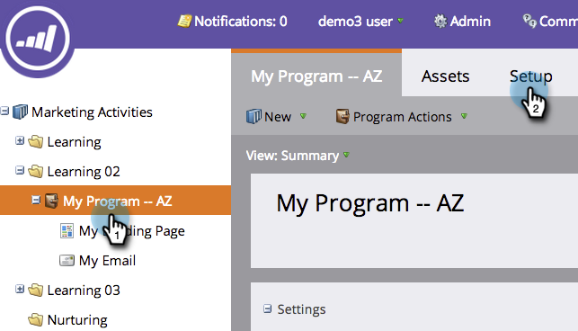
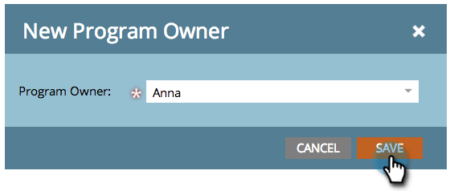
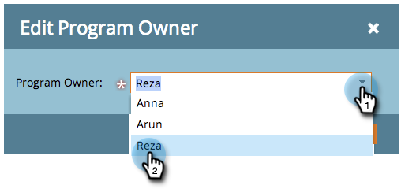
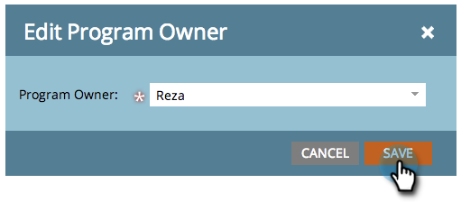
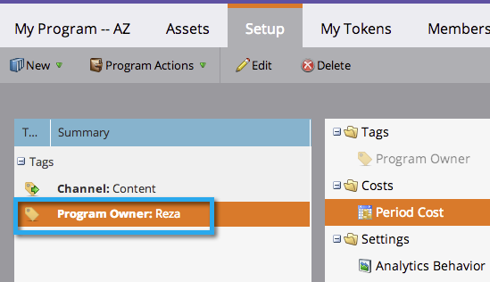
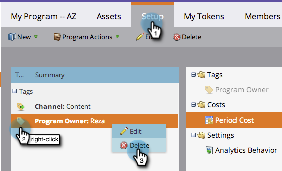
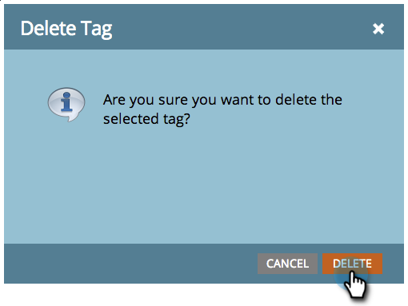

# Use Tags in a Program {#use-tags-in-a-program}

Tags are attributes that describe your programs and are used to group program types in reporting.

## Use a Tag in a Program {#use-a-tag-in-a-program}

1. Select your program. Click **[!UICONTROL Setup]**.

   

1. Drag and drop a tag onto the canvas.

   

1. Select a value from the drop-down.

   

1. Click **[!UICONTROL Save]**.

   

1. Right on. You'll see the new tag in the canvas.

   

## Edit a Tag {#edit-a-tag}

1. Go to the **[!UICONTROL Setup]** tab. Right-click the tag. Select **[!UICONTROL Edit]**.

   

1. Click the drop-down. Select a new value.

   

1. Click **[!UICONTROL Save]**.

   

1. Great! You should see the edits reflected in the canvas.

   

## Delete a Tag  {#delete-a-tag}

1. Go to the **[!UICONTROL Setup]** tab. Right-click the tag and select **[!UICONTROL Delete]**.

   

1. Click **[!UICONTROL Delete]** to confirm.

   

High five! It's gone. Programs with consistent tags make things much easier when you run your reports.
