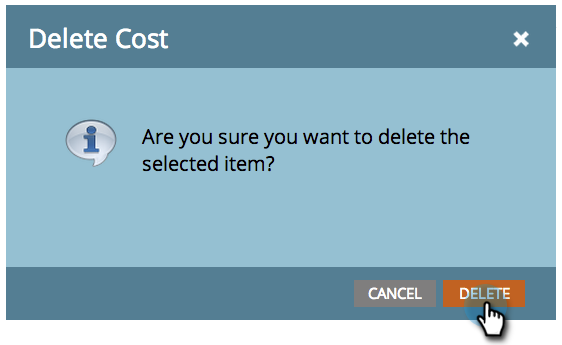

# Using Period Costs in a Program {#using-period-costs-in-a-program}

A [period cost](/help/marketo/product-docs/core-marketo-concepts/programs/working-with-programs/understanding-period-costs.md) is the amount you spend on a program. It can be for one or more months and is used for reporting ROI.

## Add a Period Cost  {#add-a-period-cost}

1. Go to the **Setup** tab of your program.

   

1. Drag and drop **Period Cost** into the canvas.

   

1. Click the calendar icon. Select a month. Click **OK**.

   

1. Enter a **Period Cost** (without decimals or commas). Click **Save**.

   >[!NOTE]
   >
   >This can be an estimate. You can always edit a period cost once you know the exact amount (see the next section).

   

1. The cost displays in the program.

   

   >[!TIP]
   >
   >You can drag and drop multiple period costs into the canvas. This lets you attribute multiple months with different period costs to your program.

## Edit a Period Cost {#edit-a-period-cost}

1. If you spend more or less money than originally projected, you can edit the period cost.

1. Go to the **Setup** tab of your program.

   

1. Right-click on the **Period Cost**. Select **Edit**.

   

1. Make your edits. Click **Save**.

   

## Delete a Period Cost {#delete-a-period-cost}

1. Go to the **Setup** tab of your program.

   

1. Right-click on the **Period Cost**. Select **Delete**.

   

1. Click **Delete** to confirm.

   

>[!MORELIKETHIS]
>
>* [Understanding Period Costs](/help/marketo/product-docs/core-marketo-concepts/programs/working-with-programs/understanding-period-costs.md)
>* [Filter a Program Report by Period Cost](/help/marketo/product-docs/core-marketo-concepts/programs/program-performance-report/filter-a-program-report-by-period-cost.md)
