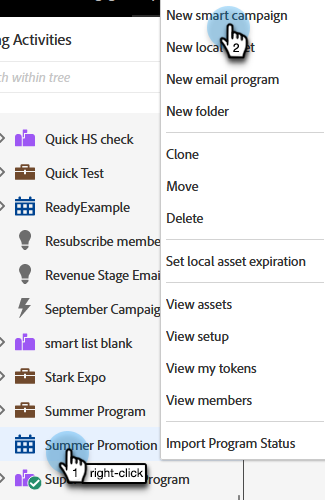
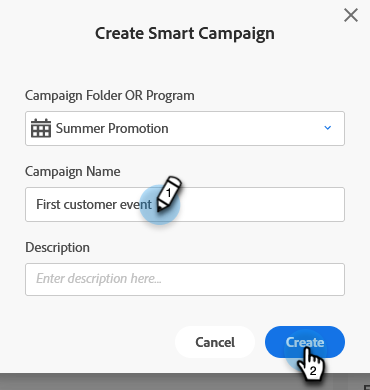

# Create a New Smart Campaign {#create-a-new-smart-campaign}

Smart Campaigns are the most important tool in Marketo Engage. They can trigger on one person and perform actions, or rollup millions of people and run a series of flow steps.

>[!TIP]
>
>Learn more about [Smart Campaigns](/help/marketo/product-docs/core-marketo-concepts/smart-campaigns/understanding-smart-campaigns.md){target="_blank"}.

1. Go to **[!UICONTROL Marketing Activities]**.

   

1. Right-click on the desired program and select **[!UICONTROL New Smart Campaign]**.

   

   >[!TIP]
   >
   >You can create Smart Campaigns as local assets of any program.

1. Enter the Smart Campaign name and click **[!UICONTROL Create]**.

   

   Next, learn how to define which people to run through the Smart Campaign with a Smart List.

   >[!MORELIKETHIS]
   >
   >* [Define Smart List for Smart Campaign | Batch](/help/marketo/product-docs/core-marketo-concepts/smart-campaigns/creating-a-smart-campaign/define-smart-list-for-smart-campaign-batch.md){target="_blank"}
   >* [Define Smart List for Smart Campaign | Trigger](/help/marketo/product-docs/core-marketo-concepts/smart-campaigns/creating-a-smart-campaign/define-smart-list-for-smart-campaign-trigger.md){target="_blank"}
