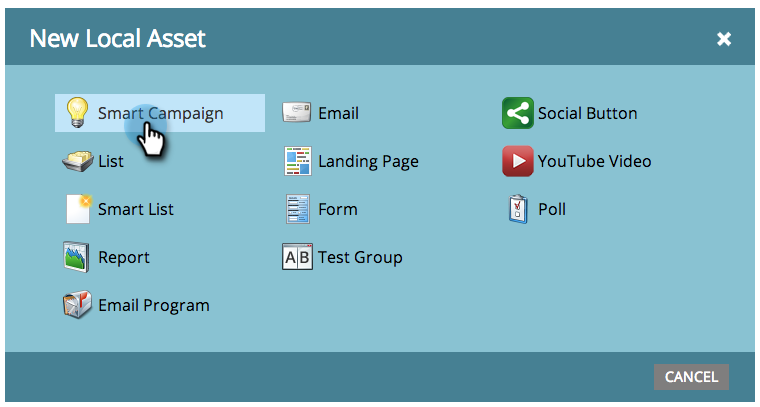
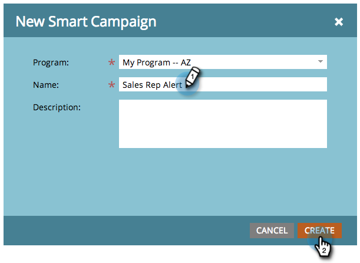

# Create a New Smart Campaign {#create-a-new-smart-campaign}

Smart campaigns are the most important tool in Marketo. They can trigger on one person and perform actions, or rollup millions of people and run a series of flow steps.

>[!NOTE]
>
>**Deep Dive**
>
>Smart campaigns are super cool. Learn more about them [here](../../../../product-docs/core-marketo-concepts/smart-campaigns/understanding-smart-campaigns.md).

1. Go to **Marketing Activities**.

   

1. Choose a **Program**, and then under **New** click on **New Local Asset**.

   

   >[!TIP]
   >
   >You can create smart campaigns as local assets of any program.

1. Click on **Smart Campaign**.

   

1. Enter the smart campaign name and click **Create**.

   

   Cool! Next up, learn how to define which people to run through the smart campaign with a smart list.

   >[!NOTE]
   >
   >**Related Articles**
   >
   >    
   >    
   >    * [Define Smart List for Smart Campaign | Batch](define-smart-list-for-smart-campaign-batch.md)
   >    * [Define Smart List for Smart Campaign | Trigger](define-smart-list-for-smart-campaign-trigger.md)
   >    
   >

