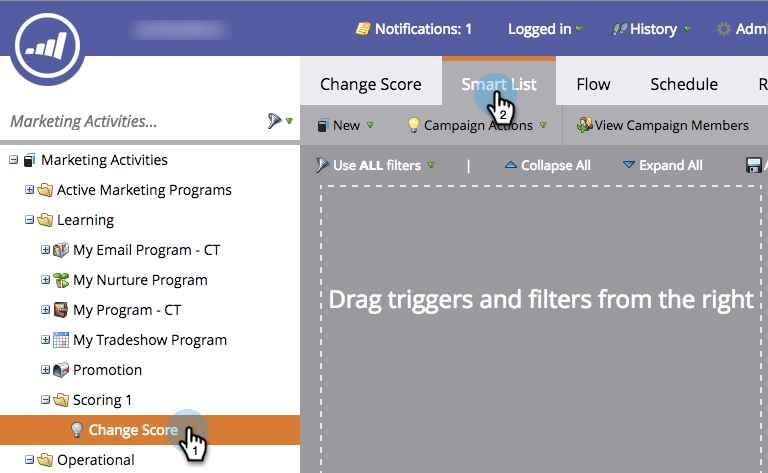
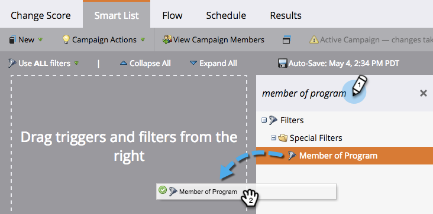
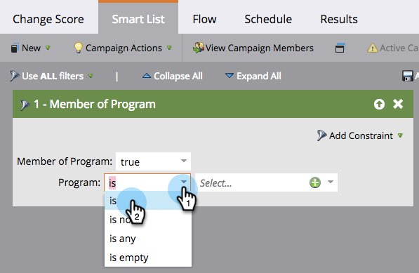

# Define Smart List for Smart Campaign | Batch {#define-smart-list-for-smart-campaign-batch}

Smart lists are the mechanism throughout Marketo to define "who" (which people) to include, whether it's a report, a list, or a smart campaign. Here's how to define a smart list for a batch campaign.

1. Choose a smart campaign, then click **Smart List**.

   

1. Type to search for a filter and then drag and drop it to the canvas. Repeat for multiple filters.

   

   >[!NOTE]
   >
   >A smart campaign with only filters runs in **Batch** mode. It finds people in the database that qualify based on the filters and runs all of them through the flow at once.

   >[!NOTE]
   >
   >You can make a smart campaign run on one person at a time based on live events by adding triggers, which puts the smart campaign in **Trigger** mode.

1. Click the drop-down and choose a filter operator for the filter you chose.

   

   >[!CAUTION]
   >
   >Red squiggly lines indicate errors or missing information. If not corrected, the campaign will be invalid and won't run.

1. Enter the filter value.

   

   >[!NOTE]
   >
   >By default, people who satisfy ALL the smart list rules are qualified. This can be modified to suit your campaign needs. Check out  [Smart List Rules for Complex Logic](/help/marketo/product-docs/core-marketo-concepts/smart-lists-and-static-lists/using-smart-lists/using-advanced-smart-list-rule-logic.md) to learn more.

   To trigger on live events one person at a time, learn how to [Define Smart List for Smart Campaign | Trigger](/help/marketo/product-docs/core-marketo-concepts/smart-campaigns/creating-a-smart-campaign/define-smart-list-for-smart-campaign-trigger.md).

   >[!MORELIKETHIS]
   >
   >* [Define Smart List for Smart Campaign | Trigger](/help/marketo/product-docs/core-marketo-concepts/smart-campaigns/creating-a-smart-campaign/define-smart-list-for-smart-campaign-trigger.md)
   >* [Add a Flow Step to a Smart Campaign](/help/marketo/product-docs/core-marketo-concepts/smart-campaigns/flow-actions/add-a-flow-step-to-a-smart-campaign.md)
