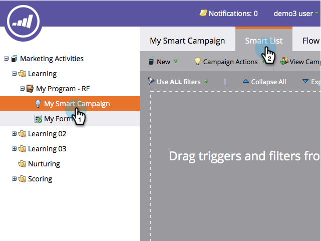
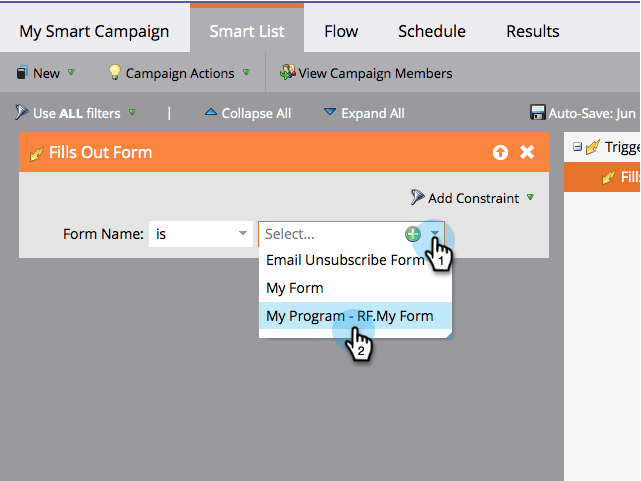

# Define Smart List for Smart Campaign | Trigger {#define-smart-list-for-smart-campaign-trigger}

Make a smart campaign run on one person at a time based on live events by adding triggers.

1. In your smart campaign, click the **Smart List **tab.

   

1. Search for the trigger and then drag and drop the trigger to the canvas.

   

   >[!NOTE]
   >
   >A smart campaign with triggers runs in **Trigger** mode. It runs on one person at a time based on events triggered and any additional filters.

1. Click the drop-down and choose an operator.

   

   >[!CAUTION]
   >
   >Red squiggly lines indicate errors or missing information. If not corrected, the campaign will be invalid and won't run.

   >[!TIP]
   >
   >In a smart campaign with both triggers and filters, the triggers go at the top and when triggered, only people who satisfy the filter criteria go through the flow.

1. Define the trigger.

   

   >[!NOTE]
   >
   >With multiple triggers, a person goes through the flow if **ANY** one of the triggers gets activated.

   [Define Smart List for Smart Campaign | Batch](define-smart-list-for-smart-campaign-batch.md)

   >[!NOTE]
   >
   >**Related Articles**
   >
   >    
   >    
   >    * [Define Smart List for Smart Campaign | Batch](define-smart-list-for-smart-campaign-batch.md)
   >    * [Add a Flow Step to a Smart Campaign](../../../../product-docs/core-marketo-concepts/smart-campaigns/flow-actions/add-a-flow-step-to-a-smart-campaign.md)
   >    
   >

To run the campaign on a set of people all at the same time, learn how to . 