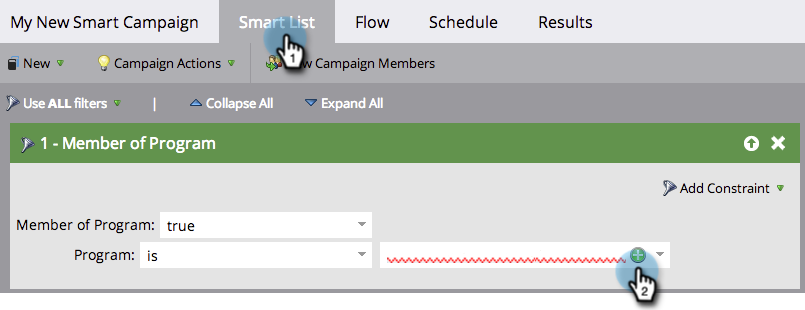
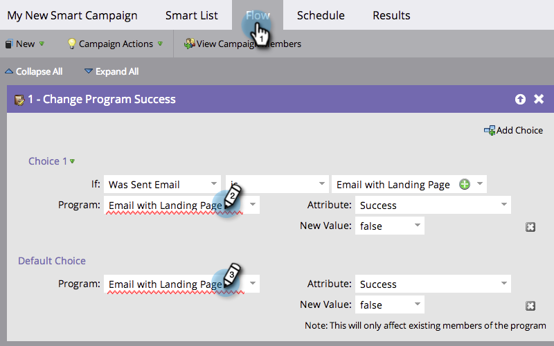
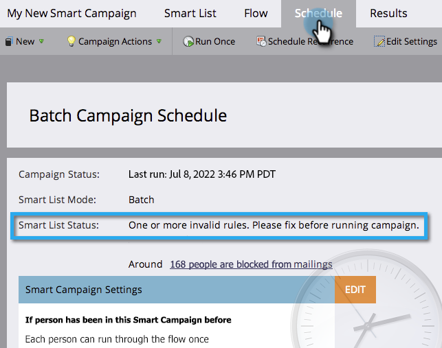
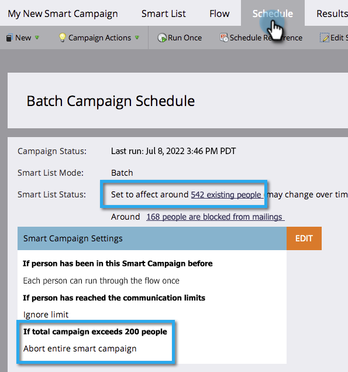

# Smart Campaign Checklist {#smart-campaign-checklist}

Follow the below steps to ensure smooth running of the Smart Campaign and prevent errors as much as possible.

## Get Rid of Smart List Errors {#get-rid-of-smart-list-errors}

   In your Smart Campaign, click on **Smart List**. Get rid of any red squiggly lines that you see by fixing the errors.

   

   >[!TIP]
   >
   >Red squiggly lines indicate errors or missing information. If not corrected, the campaign will be invalid and won't run.
   >
   >Also, **keep things simple**. If you have dozens or hundreds of filters, it's hard to maintain it and keep track. Fewer filters are also faster to load.

   >[!NOTE]
   >
   >Using **Member of Smart List** could have errors in that other list. Check there too.

## Get Rid of Flow Errors {#get-rid-of-flow-errors}

In your Smart Campaign, click **Flow**. Get rid of any red squiggly lines you see by fixing the errors.

   

   >[!TIP]
   >
   >Hover over the red squiggly line to see details of the error.

## Review the Schedule Tab {#review-the-schedule-tab}

In the **Schedule** tab, check **Smart** **List** **Status** for any errors in the Smart Campaign that needs fixing.

   

## Check Person Restrictions Limit {#check-person-restrictions-limit}

In the **Schedule** tab, make sure the number of qualified people does not exceed the person restriction limit.

   

   >[!TIP]
   >
   >If required, you can [override person restrictions in a Smart Campaign](/help/marketo/product-docs/core-marketo-concepts/smart-campaigns/using-smart-campaigns/override-person-restrictions-in-a-smart-campaign.md).

>[!NOTE]
>
>**Reminder**
>
>If your Smart Campaign still fails, learn how to [understand notifications](/help/marketo/product-docs/core-marketo-concepts/miscellaneous/understanding-notifications.md) to figure out what went wrong and how to fix it.

Great job! Keep this checklist handy before running a Smart Campaign.
