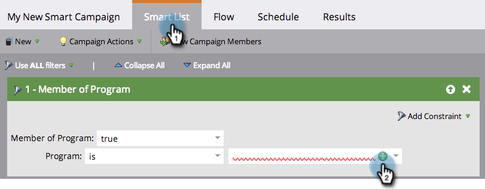
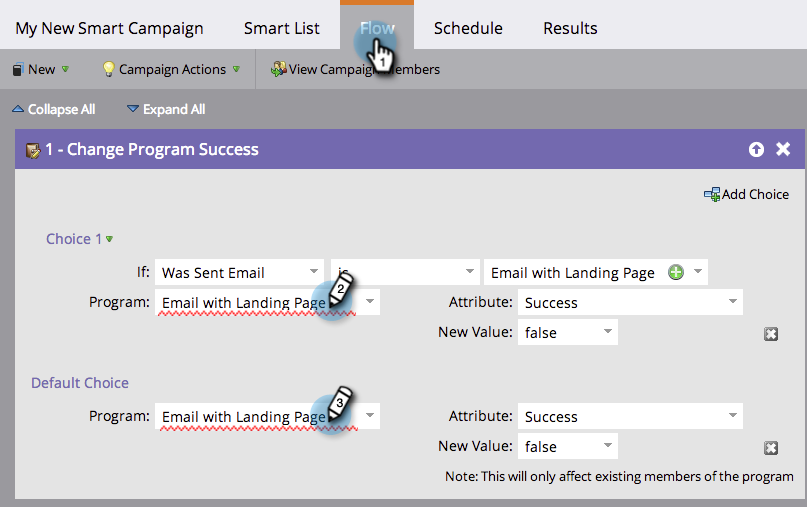
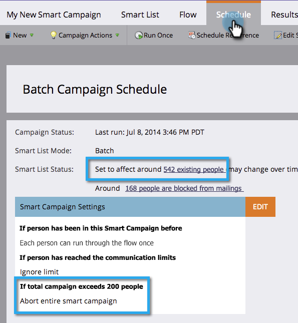

# Smart Campaign Checklist {#smart-campaign-checklist}

Follow the below steps to ensure smooth running of the smart campaign and prevent errors as much as possible.

1. Get Rid of Smart List Errors

   In your smart campaign, click on **Smart List**. Get rid of any red squiggly lines that you see by fixing the errors.

   

   >[!TIP]
   >
   >Red squiggly lines indicate errors or missing information. If not corrected, the campaign will be invalid and won't run.
   >
   >
   >Also, **keep things simple**. If you have dozens or hundreds of filters, it's hard to maintain it and keep track. Fewer filters are also faster to load.

   >[!NOTE]
   >
   >**Reminder**
   >
   >
   >Using **Member of Smart List** could have errors in that other list. Check there too.

1. Get Rid of Flow Errors
1. In your smart campaign, click on **Flow**. Get rid of any red squiggly lines you see by fixing the errors.

   

   >[!TIP]
   >
   >Hover over the red squiggly line to see details of the error.

1. Review the Schedule Tab
1. In the **Schedule** tab, check **Smart** **List** **Status** for any errors in the smart campaign that needs fixing.

   

1. Check Person Restrictions Limit
1. In the **Schedule** tab, make sure the number of qualified people does not exceed the person restriction limit.

   

   >[!TIP]
   >
   >If required, you can  [override person restrictions in a smart campaign](../../../../product-docs/core-marketo-concepts/smart-campaigns/using-smart-campaigns/override-person-restrictions-in-a-smart-campaign.md).

>[!NOTE]
>
>**Reminder**
>
>If your smart campaign still fails, learn how to [understand notifications](../../../../product-docs/core-marketo-concepts/miscellaneous/understanding-notifications.md) to figure out what went wrong and how to fix it.

Great job! Keep this checklist handy before running a smart campaign. 