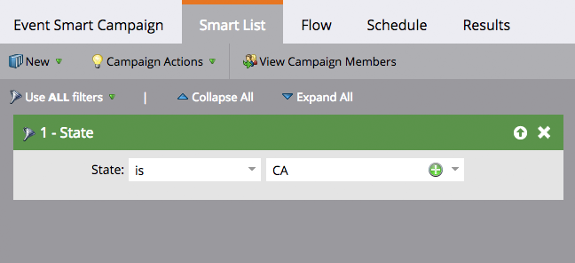

# Understanding Batch and Trigger Smart Campaigns {#understanding-batch-and-trigger-smart-campaigns}

There are two types of smart campaigns: Batch and Trigger.

>[!NOTE]
>
>**FYI**
>
>Marketo is now standardizing language across all subscriptions, so you may see lead/leads in your subscription and person/people in docs.marketo.com. These terms mean the same thing; it does not affect article instructions. There are some other changes, too. [Learn more](http://docs.marketo.com/display/DOCS/Updates+to+Marketo+Terminology).

## Batch Smart Campaign {#batch-smart-campaign}

>[!NOTE]
>
>**Definition**
>
>A batch campaign launches at a specific time and affects a specific set of people all at once. An example would be sending an email to all people in California.

Batch smart campaigns will only have filters within the smart list section (i.e., no triggers).

Clicking on the **Schedule** tab will confirm that the smart campaign is set to "Batch."

**Batch Smart Campaigns**

* Can be scheduled for recurrences, such as daily, weekly, and monthly. You can also have them run just once.
* Are visible on the [program schedule view](../../../../product-docs/core-marketo-concepts/programs/program-schedule-view/navigating-the-program-schedule-view.md).   
  &#42;Note that anything after a "Wait" step within the smart campaign will not be included on the view.

---

## Trigger Smart Campaign {#trigger-smart-campaign}

>[!NOTE]
>
>**Definition**
>
>A trigger smart campaign affects one person at a time based on a triggered event. An example of a trigger would be clicking a link in an email.

If a smart campaign uses at least one trigger within the smart list section, the mode will automatically be set to triggered.

Clicking on the **Schedule** tab will confirm that the smart campaign is set to "Triggered."

**Trigger Smart Campaigns**

* Cannot be scheduled for recurrences. They can only be set to active or inactive.
* You can set more than one trigger. However, if any trigger is fired the campaign actions will run.

## Watch a Video on Creating Triggered Email Campaigns {#watch-a-video-on-creating-triggered-email-campaigns}

`<iframe width="630" height="470" src="//play.vidyard.com/6zNazwTgt2LNeCjPAt3W9K.html?v=3.1.1" frameborder="0" allowfullscreen></iframe>` 

>[!TIP]
>
>Use the [activity log](../../../../product-docs/core-marketo-concepts/smart-lists-and-static-lists/managing-people-in-smart-lists/locate-the-activity-log-for-a-person.md) to see what occurred step-by-step within your smart campaigns. You can find the activity log in the last tab of a person's detail page.

