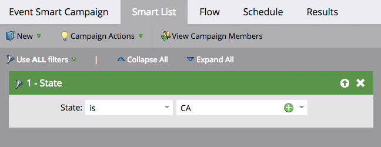
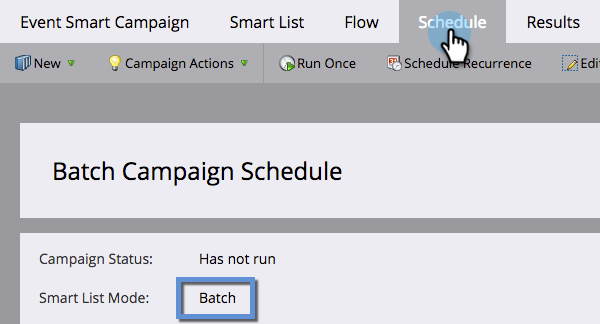
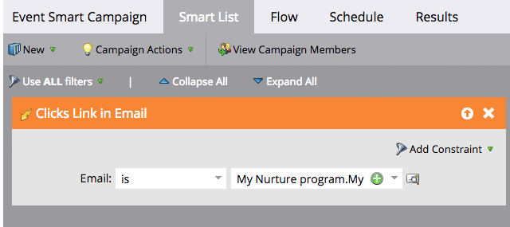
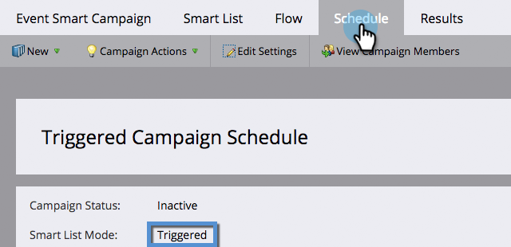

# Understanding Batch and Trigger Smart Campaigns {#understanding-batch-and-trigger-smart-campaigns}

There are two types of smart campaigns: Batch and Trigger.

## Batch Campaign {#batch-campaign}

>[!NOTE]
>
>**Definition**
>
>A Batch Campaign launches at a specific time and affects a specific set of people all at once. An example would be sending an email to all people in California.

Batch Campaigns will only have filters within the smart list section (i.e., no triggers).

Clicking the **[!UICONTROL Schedule]** tab will confirm that the Smart Campaign is set to "Batch."

**Batch Smart Campaigns**

* Can be scheduled for recurrences, such as daily, weekly, and monthly. You can also have them run just once.
* Are visible on the [program schedule view](/help/marketo/product-docs/core-marketo-concepts/programs/program-schedule-view/navigating-the-program-schedule-view.md){target="_blank"}. Anything after a "Wait" step within the Smart Campaign will not be included on the view.

 &nbsp;

## Trigger Campaign {#trigger-campaign}

>[!NOTE]
>
>**Definition**
>
>A Trigger Campaign affects one person at a time based on a triggered event. An example of a trigger would be clicking a link in an email.

If a Smart Campaign uses at least one trigger within the Smart List section, the mode will automatically be set to triggered.

Clicking the **[!UICONTROL Schedule]** tab will confirm that the Smart Campaign is set to "Triggered."

**Trigger Campaigns**

* Cannot be scheduled for recurrences. They can only be set to active or inactive.
* You can set more than one trigger. However, if any trigger is fired the campaign actions will run.

>[!TIP]
>
>Use the [activity log](/help/marketo/product-docs/core-marketo-concepts/smart-lists-and-static-lists/managing-people-in-smart-lists/locate-the-activity-log-for-a-person.md){target="_blank"} to see what occurred step-by-step within your Smart Campaigns. You can find the activity log in the last tab of a person's detail page.
