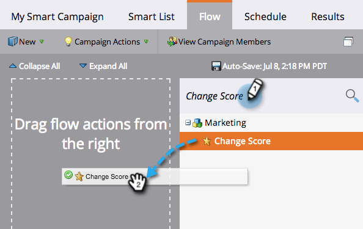
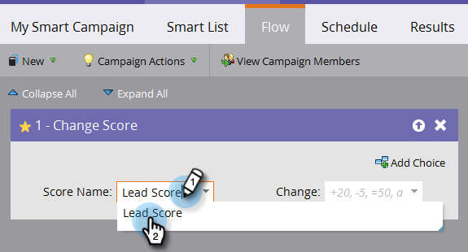
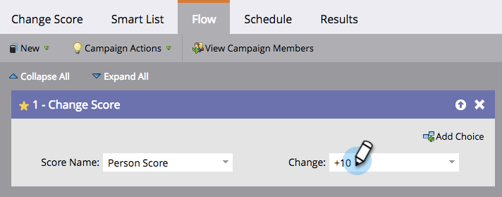

# Add a Flow Step to a Smart Campaign {#add-a-flow-step-to-a-smart-campaign}

Flow steps tell Marketo what you want to have happen to a group of people that qualify. They are your instructions, and the smart campaign will do your bidding!

1. Go to **Marketing Activities**.

   

1. Select your smart campaign and click **Flow**.

   

   Type to search for a flow step, then drag and drop it to the canvas. You can add multiple flow steps - repeat this with every step you want the campaign to perform.

   

1. Click the drop-down and choose an appropriate option.

   

1. Enter the value.

   

>[!NOTE]
>
>Flow steps are executed in the order in which they are listed.  [Reorder the flow steps](/help/marketo/product-docs/core-marketo-concepts/smart-campaigns/flow-actions/add-a-flow-step-to-a-smart-campaign/reorder-the-flow-steps-in-a-smart-campaign.md) to ensure they're in the right sequence.

>[!TIP]
>
>A red squiggly line appears in case of an invalid entry. Hover over the line to see how to correct it.

Awesome! Be sure to [review and validate the smart campaign](/help/marketo/product-docs/core-marketo-concepts/smart-campaigns/creating-a-smart-campaign/smart-campaign-checklist.md) before you schedule or activate it.

>[!MORELIKETHIS]
>
>* [Use Add Choice in a Flow Step](/help/marketo/product-docs/core-marketo-concepts/smart-campaigns/flow-actions/use-add-choice-in-a-flow-step.md)
>* [Reorder the Flow Steps in a Smart Campaign](/help/marketo/product-docs/core-marketo-concepts/smart-campaigns/flow-actions/add-a-flow-step-to-a-smart-campaign/reorder-the-flow-steps-in-a-smart-campaign.md)
