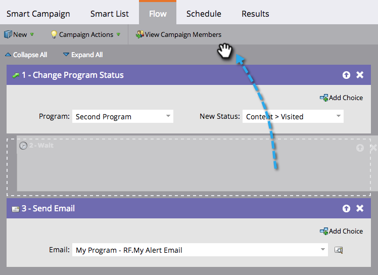

# Reorder the Flow Steps in a Smart Campaign {#reorder-the-flow-steps-in-a-smart-campaign}

The flow steps execute from top to bottom. Here's how to reorder the flow steps to suit your needs.

>[!PREREQUISITES]
>
>* [Add a Flow Step to a Smart Campaign](../../../../../product-docs/core-marketo-concepts/smart-campaigns/flow-actions/add-a-flow-step-to-a-smart-campaign.md)
>

1. In your smart campaign Flow tab, drag and drop the flow step to where you want it.

>[!NOTE]
>
>**Reminder**
>
>The flow steps run in the order in which they appear in the flow.

Some things are just kinda simple. Drag n' drop away! 