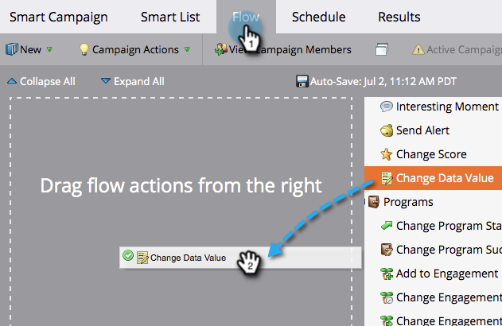
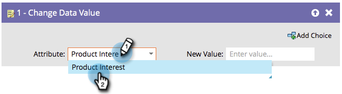

# Append Data to a Field {#append-data-to-a-field}

There's an easy way to append data to a field. Here's how.

>[!PREREQUISITES]
>
>[Create a Campaign](/help/marketo/product-docs/core-marketo-concepts/smart-campaigns/creating-a-smart-campaign/create-a-new-smart-campaign.md){target="_blank"}

>[!NOTE]
>
>The steps below also apply to [Change Program Member Data](/help/marketo/product-docs/core-marketo-concepts/smart-campaigns/program-flow-actions/change-program-member-data.md){target="_blank"}.

1. Under the **[!UICONTROL Flow]** tab, drag in the **[!UICONTROL Change Data Value]** flow step.

   

1. Find and select the field you want to append data to.

   

1. Find and select the token for the same field you want to append data to.

   

1. Now add the value you want to append to what already exists in the field.

   

That's it! You can get creative and add multiple tokens in there.
