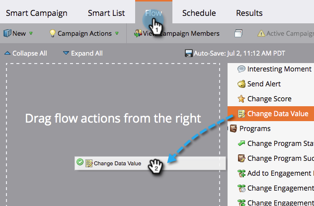

# Append Data to a Field {#append-data-to-a-field}

There's an easy way to append data to a field. Here's how.

>[!NOTE]
>
>**Prerequisites**
>
>* [Create a Campaign](../../../../product-docs/core-marketo-concepts/smart-campaigns/creating-a-smart-campaign/create-a-new-smart-campaign.md)
>

1. Under the **Flow** tab, drag in the **Change Data Value** flow step.

   

1. Find and select the field you want to append data to.

   

1. Find and select the token for the same field you want to append data to.

   

1. Now add the value you want to append to what already exists in the field.

   

   That's it! You can get creative and add multiple tokens in there.

