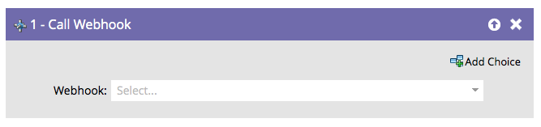

# Call Webhook {#call-webhook}

>[!PREREQUISITES]
>
>[Create a Webhook](/help/marketo/product-docs/administration/additional-integrations/create-a-webhook.md)

## Overview {#overview}

Webhooks let you interact with third party services. Send/receive information by calling a webhook in a smart campaign flow.

>[!NOTE]
>
>Learn about the many fascinating things that [Webhooks](https://developers.marketo.com/documentation/webhooks/) can do for you.

## Usage {#usage}

Select a **[!UICONTROL Webhook]** from the drop-down.

That's all! Your webhook will now be invoked whenever people enter the smart campaign flow.

>[!MORELIKETHIS]
>
>[Use a Webhook in a Smart Campaign](/help/marketo/product-docs/core-marketo-concepts/smart-campaigns/flow-actions/use-a-webhook-in-a-smart-campaign.md)
