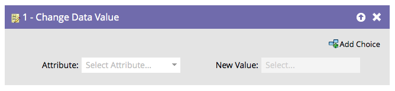
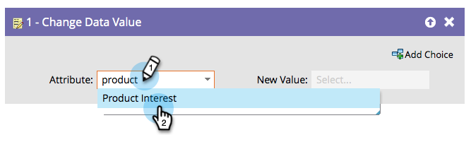

# Change Data Value {#change-data-value}

You can use Marketo to update the value of a field. For this, you will use the **[!UICONTROL Change Data Value]** flow action.

>[!NOTE]
>
>You can also block a field from being updated. See [Block Updates to a Field](/help/marketo/product-docs/administration/field-management/block-updates-to-a-field.md){target="_blank"} for details.

1. Find and select the field you want to change the value of.

   

1. Enter the value you want, and you're done!

   

   >[!NOTE]
   >
   >You can also use tokens in **[!UICONTROL New Value]**.

   >[!TIP]
   >
   >You can enter 'NULL' (no quotes, all caps) in **[!UICONTROL New Value]** to clear the field. See [Clear Field Values](/help/marketo/product-docs/core-marketo-concepts/smart-campaigns/flow-actions/clear-field-values.md){target="_blank"} for details.

   >[!NOTE]
   >
   >* [Tokens for Flow Steps](/help/marketo/product-docs/core-marketo-concepts/smart-campaigns/flow-actions/use-tokens-in-flow-steps.md){target="_blank"}
   >* [Append Data to a Field](/help/marketo/product-docs/core-marketo-concepts/smart-campaigns/flow-actions/append-data-to-a-field.md){target="_blank"}
