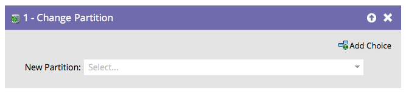
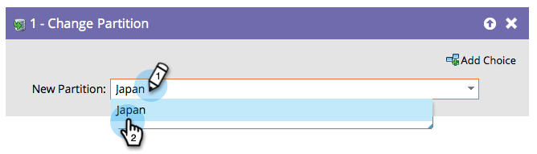

# Change Person Partition {#change-person-partition}

If you are using [workspaces and partitions](/help/marketo/product-docs/administration/workspaces-and-person-partitions/understanding-workspaces-and-person-partitions.md){target="_blank"}, you will want to build smart campaigns to move people from one partition to another.

1. Select the Partition you want to move your people to.

It's that easy!
