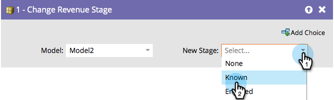

# Change Revenue Stage {#change-revenue-stage}

Change Revenue Stage - Marketo Docs - Product Documentation

#### Overview {#overview}

If you're using Revenue Cycle Modeler and have an approved model, you may decide to move leads manually from one stage to another. This flow step will help.

#### Usage {#usage}

1. Select the **Model**.

   

1. Select the **New Stage** you want to assign and you're done!

   

   >[!CAUTION]
   >
   >The data warehouse pays close attention to when leads move between stages. This can create bad data if used incorrectly.

