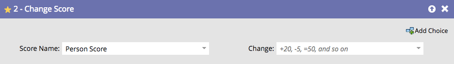

# Change Score {#change-score}

## Overview {#overview}

Scoring people is easy and powerful to help your sales team prioritize.

## Usage {#usage}

1. Pick the score field you want to change.

   

   >[!TIP]
   >
   >You can create multiple score fields. See  [Create a Custom Field in Marketo](../../../../product-docs/administration/field-management/create-a-custom-field-in-marketo.md) for details.

1. Enter the score change you want.

   

   Changes:

    * **+5** to increment 
    * **-5** will decrement (negative numbers allowed)
    * **=5** will make the score that exact number
    * **=-5** will make the score that exact negative number

   Get some basic scoring in place quickly and then tweak the results over time. That's what we did!

