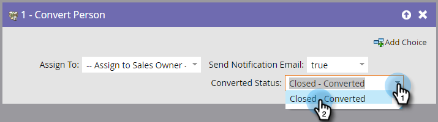

# Convert Person {#convert-person}

>[!NOTE]
>
>Only available when integrated with [!DNL Salesforce].

## Overview {#overview}

Use this flow step to convert a person to a contact in [!DNL Salesforce]. You can decide who to assign the contact to, to send a notification to the owner, and to set a converted status.

## Usage {#usage}

1. Select who you want to assign the resulting contact, account, and opportunity to.

   

   >[!CAUTION]
   >
   >Converting a person in Marketo will result in a new account and opportunity in [!DNL Salesforce]. If you don't want duplicate accounts, use [!DNL Salesforce] to convert.

1. Choose if you want a **[!UICONTROL notification]** sent to the owner or not.

   

1. Select the **[!UICONTROL converted status]**.

   

And there you go!
