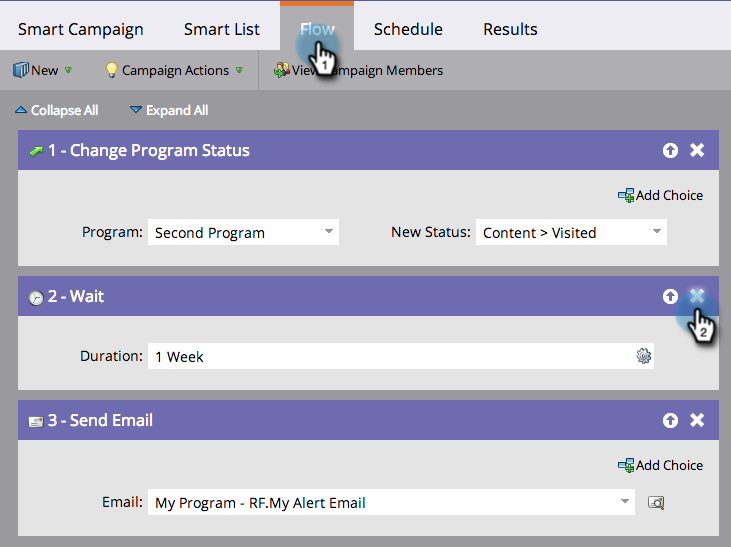
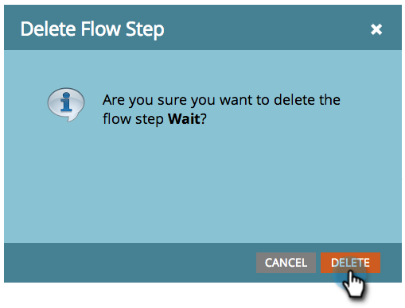

# Delete a Flow Step {#delete-a-flow-step}

>[!CAUTION]
>
>Removing flow steps, _especially wait steps_ from active Smart Campaigns, can have unexpected results. Read this article carefully.

First let's cover the basics. Here's how to remove an unwanted flow step from a Smart Campaign. 

1. In the Smart Campaign **[!UICONTROL Flow]**, click the **X** icon to delete any flow step.

1. Click **[!UICONTROL Delete]**.

   

   Simple and easy, right? Well, most of the time...

   >[!CAUTION]
   >
   >Deleting, adding, and moving steps inside an _active_ campaign can definitely have unexpected results. Consider creating a new campaign, testing it, and then switching.

   Changes can be made to an active campaign but may have unforeseen consequences. Here are the details:

   **Batch Smart Campaigns**

   If your campaign:

    1. **Never ran**. Make all the changes you want. It won't affect anyone until you run that campaign.
    1. **Is a recurring Smart Campaign**. The changes will affect people in the future runs, not previous runs.
    1. **Already ran WITHOUT wait steps**.No people will be affected because the campaign is dormant after running.
    1. **Is running right now**. Changes can cause unexpected behavior depending on the timing and details of the delete. We strongly recommend NOT editing a batch campaign that's actively running. For emergency cases, learn how to [abort a running Smart Campaign](/help/marketo/product-docs/core-marketo-concepts/smart-campaigns/using-smart-campaigns/abort-a-smart-campaign.md){target="_blank"}.

    1. **Already ran WITH wait steps.** Several details on this one.  
       When a person enters a wait step, the person jots down the duration and which NUMBER STEP to return to. See example below.

   **Trigger Smart Campaigns**

    1. **No wait steps**. If you delete a normal step, only people who run through the campaign in the future will be affected.
    1. **With wait steps**. See example below for batch campaigns. The same logic applies.

   >[!NOTE]
   >
   >**Example**
   >
   >1. A Smart Campaign has 3 steps.
   >    * STEP 1. Send Email #1  
   >    * STEP 2. Wait 1 week  
   >    * STEP 3. Send Email #2
   >
   >1. People who hit **Step 2** will wait 1 week before moving on to **Step 3**.
   >1. You delete **Step 2** during the week.
   >1. People will continue to wait the 1 week (they do not automatically pop back into the flow).
   >1. When they finally return, they will try to go to **Step 3**. They will not find it.
   >1. **IMPORTANT:** Since there are now only 2 steps, the people _will not receive Email #2_.
