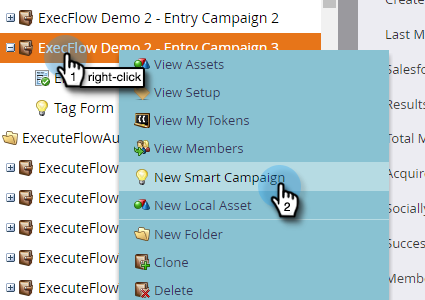
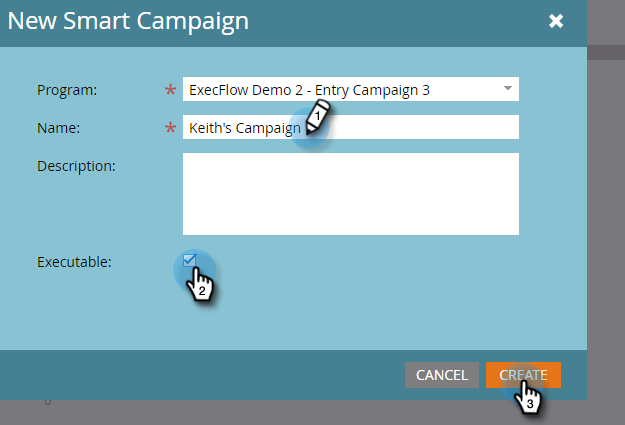
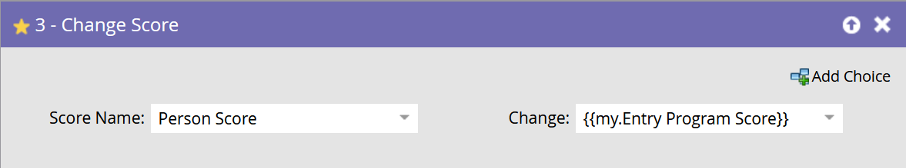
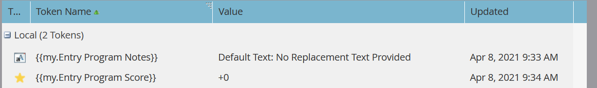
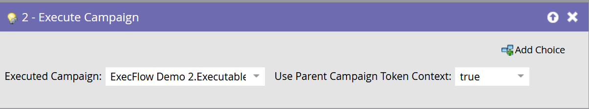
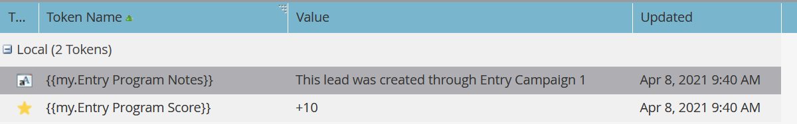
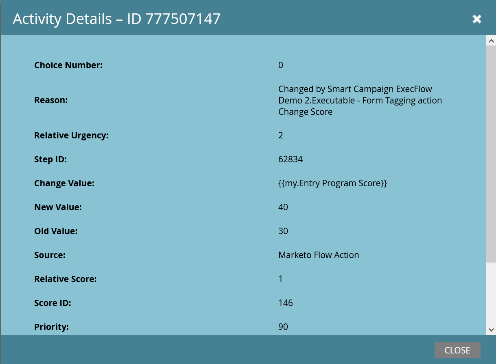
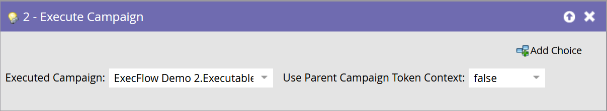
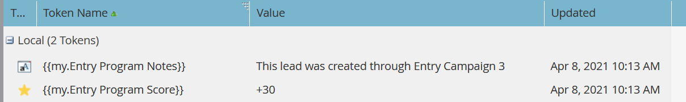
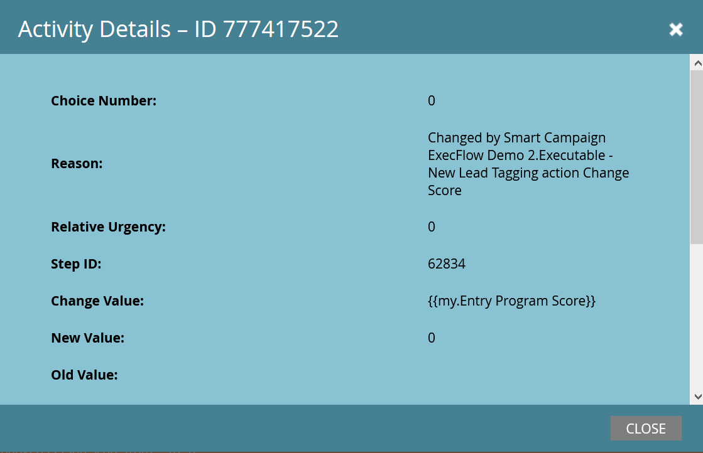

# Execute Campaign {#execute-campaign}

An Executable Campaign, like other campaigns, contains a Smart List, Flow, and Schedule. Unlike other campaigns, you do not actually schedule or activate it. It can only be called by another campaign via the Execute Campaign flow step. The flow steps in the Executable Campaign are run in series with the parent campaign (unlike Request Campaign, which runs in parallel in a separate Trigger Campaign).

>[!NOTE]
>
>Executable Campaigns are always children of the (parent) campaign that calls them.

## When to use Execute Campaign {#when-to-use-execute-campaign}

There many things you can do with an Executable Campaign. They are designed to facilitate common operational tasks, like lead routing, lifecycle management, and scoring (among others), and can be used to execute the same workflow from within Batch or Triggered Campaigns.

You can also use them when you need to run a separate flow, but you need to depend upon the results of that flow in subsequent flow step choices (i.e., if this, do that).

Execute Campaign is an improvement upon [Request Campaign](/help/marketo/product-docs/core-marketo-concepts/smart-campaigns/flow-actions/request-campaign.md), as it can run in-series or in parallel, whereas the latter only runs in parallel.

>[!NOTE]
>
>Wait Steps and Webhooks will never be compatible with Executable Campaigns. For those, you'll need to use Request Campaign instead.

## How to Create an Executable Campaign {#how-to-create-an-executable-campaign}

1. Right-click on your desired program and select **[!UICONTROL New Smart Campaign]**.

   

1. Give it a name, select the **[!UICONTROL Executable]** checkbox, and click **[!UICONTROL Create]**.

   

1. Define the Smart List and Flow, like any other Smart Campaign.

You can also clone an existing Smart Campaign. If you clone an existing Executable Campaign, you will still have to select the **[!UICONTROL Executable]** checkbox after naming it.

>[!NOTE]
>
>You can't clone a campaign that contains triggers.

## Use Parent Campaign Token Context {#use-parent-campaign-token-context}

When set to true, the following token contexts will be sent into the child campaign (the one being executed):

* My Tokens
* Campaign Tokens
* Program Tokens
* Member Tokens
* [Trigger Tokens](/help/marketo/product-docs/marketo-sales-insight/msi-for-salesforce/features/tabs-in-the-msi-panel/interesting-moments/trigger-tokens-for-interesting-moments.md) (if called from a Triggered Campaign)

**API Interaction**

When using Schedule or Request Campaign [in the API](https://developers.marketo.com/rest-api/assets/smart-campaigns/#batch), both let you pass values for My Tokens, which overrides the values set for those tokens in the campaign you're calling. If that Campaign then executes another campaign and sets "Use Parent Context to True," it will use the values passed through the API, rather than the values which are set in the application.

## Things to Note {#things-to-note}

* The Smart List will filter out anyone who doesn't qualify. If a person qualifies, the resulting Executed Campaign activity record will list them as "Qualified: TRUE" (and FALSE if they don't)
* Schedule Campaign qualification rules apply (Smart Campaign Settings under the Schedule tab)
* Executable Campaigns cannot be called across workspaces
* If you use the [Remove from Flow](/help/marketo/product-docs/core-marketo-concepts/smart-campaigns/flow-actions/remove-from-flow.md) flow action targeting an Executable Campaign, it will target both the child and parent
* Taking advantage of token inheritance - For example, if you have a single common scoring flow that's triggered by multiple different assets, you can define a default My Token score in the child campaign and in the parent campaign so that you can override the child score campaign value for your parent campaigns (see below for visual example)
* Executable Campaigns can be called up to three levels deep (e.g., Parent campaign > Child > Child > Child)

>[!CAUTION]
>
>Never leave your smart lists for Executable Campaigns invalid, otherwise **no one** will qualify for it. Best practice is to create separate smart list assets, define them completely, and make sure they're valid. Then, use the "Member of Smart List" filter in the Executable Campaign so you can swap your smart list definition.

## Token Inheritance Example {#token-inheritance-example}

Below is a visual example of Token Inheritance in one Executable Campaign and two parent campaigns: one with token context set to **True**, the other to **False**.

Child campaign with a tokenized Change Score.

The child campaign's My Tokens.

**Example One - True**

In the Execute Campaign flow step of the first parent campaign, the "[!UICONTROL Use Parent Campaign Token Context]" is set to **[!UICONTROL True]**.

The parent campaign's My Tokens.

The results: score changed by +10.

**Example Two: False**

In the Execute Campaign filter of the second parent campaign, the "[!UICONTROL Use Parent Campaign Token Context]" is set to **[!UICONTROL False]**.

The parent campaign's My Tokens.

The results: score unchanged, because the child campaign's score value, +0, was used.

