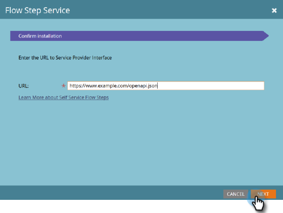
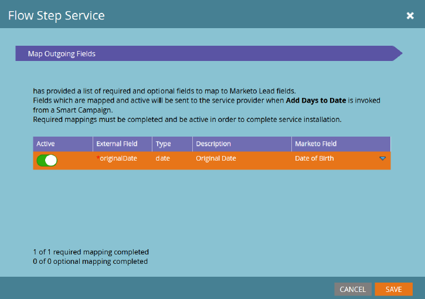
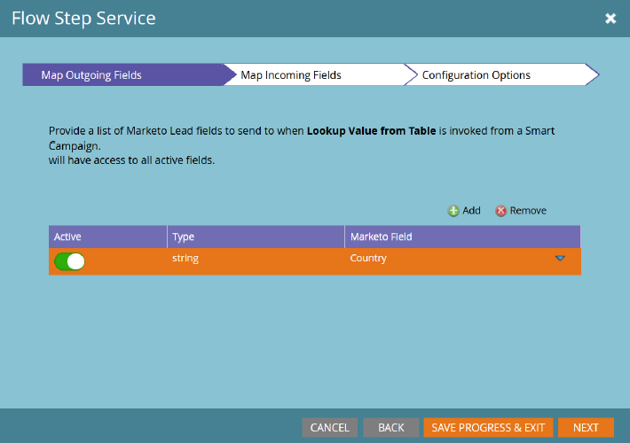
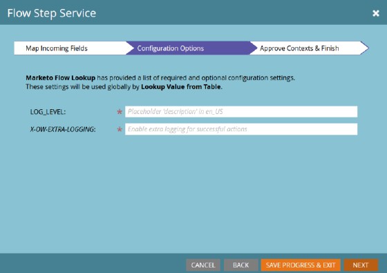
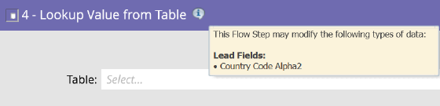

# Flow Step Service {#flow-step-service}

>[!NOTE]
>
>This pre-release feature is currently available only to accounts enrolled in the Self-Service Flow Steps Beta Program.

Self-service Flow Steps is a framework and set of features for authoring, publishing, and integrating web services into Adobe Marketo Engage Smart Campaigns. This guide is intended for Marketo Engage end users who want to install and use services which have already been created and published. For information on authoring and publishing your own service, please refer to the [GitHub repository for the Service Provider Interface](https://github.com/adobe/Marketo-SSFS-Service-Provider-Interface). A Proof-of-Concept Lookup Table implementation may be found [here](https://github.com/adobe/mkto-flow-lookup).

## Pre-Release Restrictions and Warnings {#pre-release-restrictions-and-warnings}

This feature is currently in closed beta, and has some restrictions on usage.

* This feature may only be used on Sandbox instances of Marketo Engage
* Custom and Third Party Flow steps are not compatible with Executable Campaigns as of the Q4 2021 release. This is planned to be fixed in Q2 2022
* Marketo Sky UI should not be used at all on instances with this feature enabled

## Onboarding and Managing Services {#onboarding-and-managing-services}

Installing a custom flow step requires Admin permissions in Marketo (**Manage Webhooks** in the Jan 21st release, Changing in the March 11th release). Apart from the Installation URL, all other aspects of a serviced may be edited after completing initial onboarding by drilling down into the service detail screen from the Service Providers grid.

## Installation URL {#installation-url}

To begin installation, you'll need to first obtain the URL of the OpenAPI document that defines your service. Your service provider should be able to provide this to you and will usually have a URL ending in `/openapi.json`. Complete URLs will look something like `https://www.example.com/OpenAPI.json`. Once you have this URL, go to the Service Providers menu in your Admin Section.

Click **Next** to go to the Enter Service Credentials section.

   

## Enter Service Credentials {#enter-service-credentials}

To access the service being installed, Marketo must have valid API credentials. These credentials should be provided to you by your service provider. Services have three different authentication options, so you may see one of three different prompts for credentials: **API Key** which has only one input field, **Basic Authentication** which requires a username and password and may also require a field called Realm, and **OAuth2** using the _Client Credentials_ grant, which requires a _Client ID_ and _Client Secret_.

>[!NOTE]
>
>OAuth2 will not be available until the March 11th release.

When you save your credentials, Marketo will attempt to call the status endpoint of the service to verify that they are valid. If the credentials provided are invalid, you'll see an error indicating this.

## Onboarding Guide (Optional) {#onboarding-guide}

Some service providers will including an optional Onboarding Guide step. This step will include any additional instructions to complete service onboarding which are specific to that service.

## Field Mapping {#field-mapping}

In order to receive or return data from a specific lead field, that field must be mapped. While mapping is a required step during onboarding, you may always return to alter the mappings later. There are two types of mappings that are configured in separate screens: **Outgoing Fields**, which are sent to the service when Marketo invokes the flow step, and **Incoming Fields** which are fields which may receive data from the service when it returns data to Marketo.

>[!NOTE]
>
>By mapping an outgoing field, you are giving Marketo permission to transmit data from that field related to leads that are processed by the associated service. Ensure that you have appropriate legal standing and authority to transmit this data to your service provider, as these fields may include Personally Identifiable Information covered by Data Privacy, Protection and Tenancy Laws.

Optional field mappings may be disabled without disruption to your service, but required mappings may not be removed or deactivated completely.

## Service-Driven Mappings {#service-driven-mappings}

Services that have a fixed set of inputs and outputs, like an event registration flow step, use **Service-Driven Mappings**. For this type of mapping, the service provider will provide both a datatype and a hint in the form of an API name. If the hint matches the API name of an existing lead field, then that field will automatically be populated in the mapping section. For fields without a matching hint, you will need to populate the mapping manually from the list of fields with the matching datatype. Mappings that are required must be populated to complete onboarding.

   

## User-Driven Mappings {#user-driven-mappings}

Services that do not have a fixed set of inputs and outputs, like a date-formatting service, use **User-Driven Mappings**. This means that each incoming and outgoing field must be configured by an Admin.

   

## Outgoing Fields {#outgoing-fields}

Outgoing fields are those which are sent to the Flow Step Service when that flow step is used in a smart campaign.

## Incoming Fields {#incoming-fields}

Incoming fields are those that the Flow Step Service is allowed to write data to.

## Configuration Options (Optional) {#configuration-options}

Some services have either optional or required global configuration options. If any options are required, then a value must be set for all required options before saving or completing onboarding. Parameters whose names are in italics are sent to the invoked service as headers.

   

## Retiring a Service {#retiring-a-service}

To facilitate transitions to new or alternative versions of a service, without disrupting active usage, services can be retired from the Service Providers menu. **Retiring a Service** removes the corresponding flow step from the Smart Campaign Flow Pallette, so that no new usages of it can be created. In most cases, you should have a replacement service ready to replace the existing one when you choose to retire a service.

## Service Deprecation {#service-deprecation}

Sometimes service providers will need to deprecate flow step services as a normal part of the software lifecycle. When a service provider announces this, the Deprecation Date and Message will be populated in the Service Providers grid view. Continuing to use a service that has been deprecated may result in service disruption if it no longer responds in the expected fashion, or stops accepting requests from Marketo Smart Campaigns, so you should pay close attention to any Service Deprecation notifications you receive and take appropriate steps to retire or replace any steps from the service that are still in use.

## Using Third-Party and Custom Flow Steps {#using-third-party-and-custom-flow-steps}

Installed flow steps can be used in largely the same way as standard flow steps. All flow parameters defined by the service are presented to end users.

## Refreshing Picklists {#refreshing-picklists}

Marketo will refresh picklist choices for services every night, but there are times when you will need new choices available, such as campaign creation. You can refresh these easily from any instance of your flow step using the refresh button, or by going to the Admin > Service Providers menu and clicking Refresh Picklist once you have selected your service.

## Checking Incoming Fields {#checking-incoming-fields}

You can check which incoming fields are configured for a given flow step by hovering over its tooltip icon. This is useful for determining which fields might change when a lead flows through it, so you can configure choices in subsequent steps using those fields.

   

## Incoming Fields and Data Value Changes {#incoming-fields-and-data-value-changes}

Unlike most other flow steps, ones implemented with the SSFS framework may write data back to lead fields which are mapped by an admin and record those changes as Data Value Change activities.  When a flow step writes data in this way, all of those changes will be completed before the Smart Campaign moves on to any subsequent steps, so that any data written may be relied upon in subsequent flow step choices.

## Service Logs and Statistics {#service-logs-and-statistics}

Each Flow Step Service has several types of logging associated with it to help monitor health, and troubleshoot any problems related to the integration.

## Service Statistics {#service-statistics}

The Service statistics log aggregates the results of invocations and callbacks for each service. They are grouped by time, level (chunk or record), and code, and provide counts and the most recent log message for each code received. This dashboard is principally designed to aid in monitoring service health.
